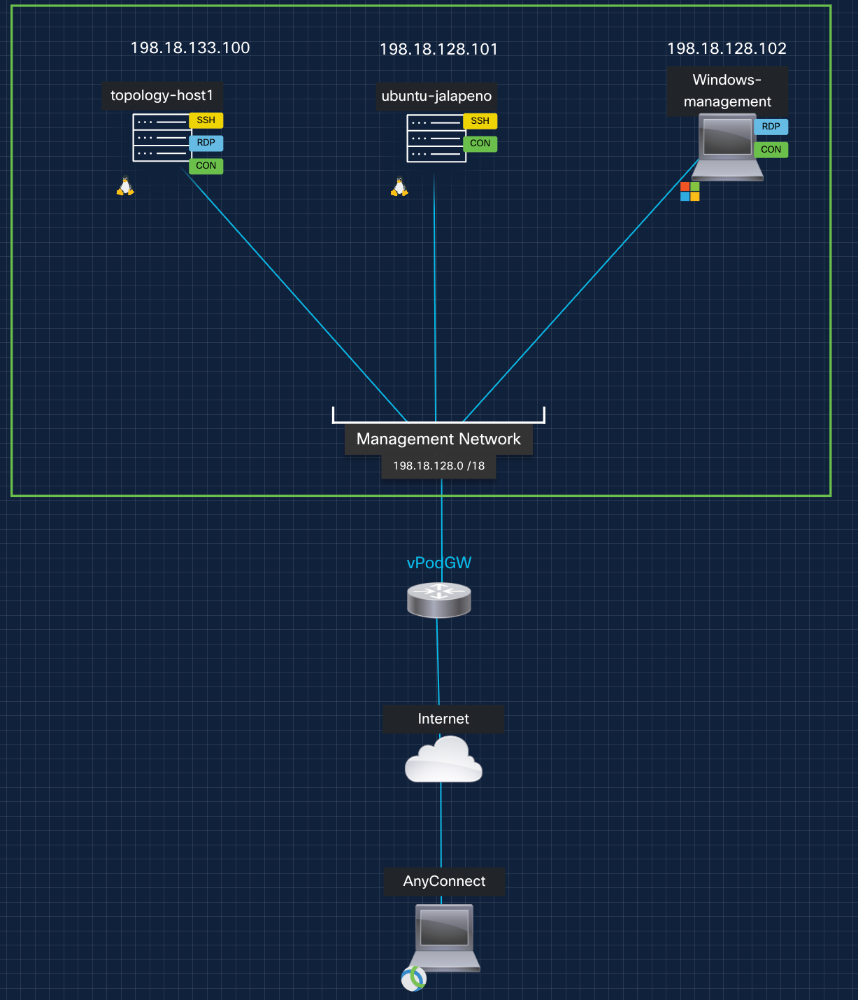
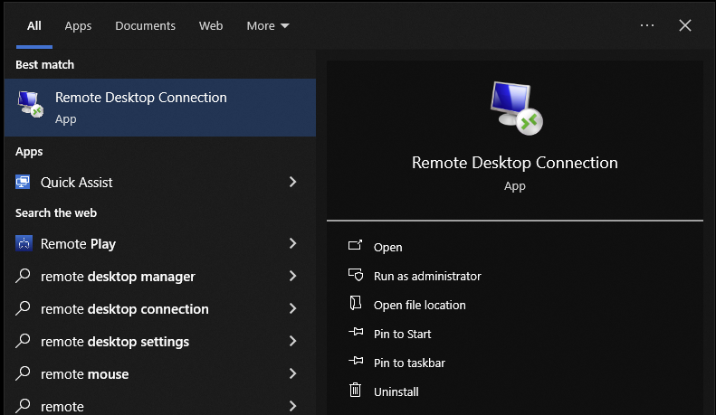
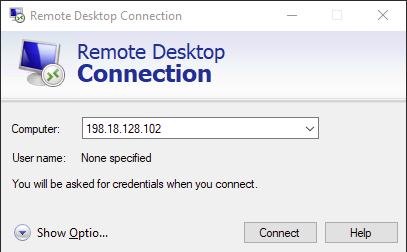
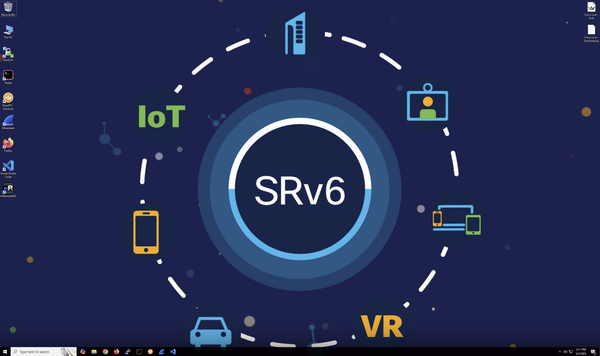

# Welcome to LTRSPG-2212: Modern AI networks: IOS-XR, SRv6, Cilium, and SONiC

## Lab Credentials:

Before starting the lab, please connect to the lab using these [credentials.](https://github.com/cisco-asp-web/LTRSPG-2212/blob/main/LTRSPG-2212-credentials.csv)

## Introduction: 

In this immersive hands-on lab we will explore how to build SRv6 WAN networks utilizing L3VPNs, next-generation AI fabric load balancing using SRv6, and Kubernetes-native SRv6 with Cilium. This session walks participants through a series of progressive tutorials and labs covering:

 - SRv6 fundamentals and foundational building blocks for SRv6 L3VPN and Traffic Engineering 

 - Kubernetes integration using Cilium and SRv6 for modern service-aware routing 
  
 - SONiC-based data center fabric bring-up and host-based SRv6 
  
 - Programmatic traffic control using custom SRv6 mappings and intelligent automation 
  
Participants will gain practical skills in deploying flexible, scalable, and programmable infrastructure purpose-built for Service Provider, AI, HPC, or cloud-native workloads.

## Contents
* Repository Overview [LINK](#github-repository-overview)
* Lab Topology [LINK](#dCloud-lab-Topology)
* Lab 1 - XRd Topology Setup and base SRv6 Config [LINK](https://github.com/cisco-asp-web/LTRSPG-2212/blob/main/lab_1/lab_1-guide.md)
* Lab 2 - SRv6 L3VPN and SRv6 TE Configuration [LINK](https://github.com/cisco-asp-web/LTRSPG-2212/blob/main/lab_2/lab_2-guide.md)
* Lab 3 - Kubernetes SRv6 with Cilium [LINK](https://github.com/cisco-asp-web/LTRSPG-2212/blob/main/lab_3/lab_3-guide.md)
* Lab 4 - SONiC DC Fabric Bring Up [LINK](https://github.com/cisco-asp-web/LTRSPG-2212/blob/main/lab_4/lab_4-guide.md)
* Lab 5 - SONiC and Host Based SRv6 for Intelligent Fabric Load Balancing [LINK](https://github.com/cisco-asp-web/LTRSPG-2212/blob/main/lab_5/lab_5-guide.md)

## Github Repository Overview
Each of the labs is designed to be completed in the order presented.

### Root Directory

| File Name      | Description                                                          |
|:---------------|:---------------------------------------------------------------------|
| infrastructure | Base configurations for the non-router containers and VMs in the lab |
| topo_drawings  | Lab diagrams folder                                                  |
| lab_1 -> lab_5 | Individual lab folders                                               |

### Individual Lab Directories
Within each lab directory you should see several files of importance:
(X = lab #)

| File Name                | Description                                                  |
|:-------------------------|:-------------------------------------------------------------|
| cleanup-lab_X.sh         | Cleans up the containerlab topology and files                |
| lab_X-topology.clab.yaml | YAML input file for containerlab to create the topology      |
| lab_X-guide.md           | User guide for this lab                                      |

> [!NOTE]
> We've recently launched a whole series of SRv6 labs on github, many of which leverage Containerlab and XRd:
> 
> https://github.com/segmentrouting/srv6-labs

# dCloud Instances 

Each lab instance is running on Cisco dCloud and is reachable via AnyConnect VPN. In the Webex Teams room for the lab we've provided a spreadsheet with a list of dCloud instances and the AnyConnect credentials necessary to access each instance. To find your dCloud instance please reference your student number provided on the handout in class.

# dCloud lab Topology

The following diagram shows the dCloud VM topology that will be used for this lab:

This lab environment consists of three virtual machines, each with a specific role. Here’s what each VM is responsible for:

## 💻 Lab Virtual Machines Summary

| VM Name              | IP Address       | Role / Description                                                                                                     | Key Tools / Use Cases                                                                                          |
|----------------------|------------------|------------------------------------------------------------------------------------------------------------------------|---------------------------------------------------------------------------------------------------------------|
| **Windows Management** | `198.18.128.102` | RDP-accessible Windows VM for student interaction with the lab                                                        | - Lab documentation access - VS Code with SSH and extensions:  &nbsp;&nbsp;• Start/stop topologies  &nbsp;&nbsp;• Capture traffic  &nbsp;&nbsp;• Access containers and Linux hosts |
| **Topology Host**    | `198.18.133.100` | Primary VM that hosts our SONiC and XRd networks deployed via Containerlab                        | - `Containerlab` to define and deploy topologies (`*.clab.yaml`) - `Edgeshark` for in-container packet captures |
| **Jalapeno Host**    | `198.18.128.101` | Hosts **Project Jalapeno**, an open-source SDN controller framework        | - SDN automation & path computation - Real-time topology modeling - Graph database              |

## 🔐 Lab VM Credentials

| VM Name               | Username   | Password       |
|-----------------------|------------|----------------|
| **Windows Management**| `admin`    | `cisco123`     | 
| **Topology Host**     | `cisco`    | `cisco123`     | 
| **Jalapeno Host**     | `cisco`    | `cisco123`     | 

## Connecting to your lab

The proctors will walk you through on how you connect connect to your individual dCloud lab instance.

Once you've connected to VPN using the lab assistant, all nodes in the lab can be accessed using a Remote Desktop connection to the windows management hosts at 198.18.128.102 (admin / cisco123). Here is how to launch a remote desktop connection from your windows computer:

By now, you should be connected to your main Windows workplace for this lab:

On the Windows virtual machine, please launch firefox you shoud arrive on the github page automatically. Please proceed to [LAB 1](https://github.com/cisco-asp-web/LTRSPG-2212/blob/main/lab_1/lab_1-guide.md)
