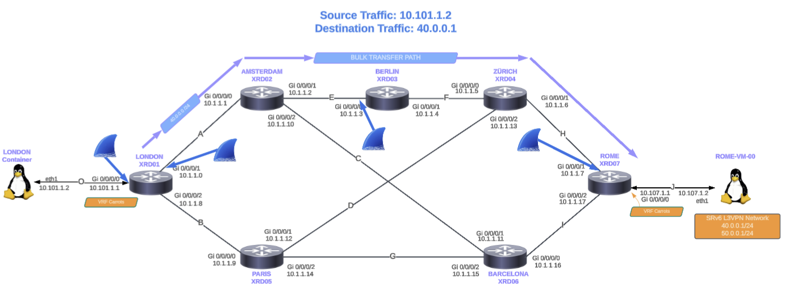
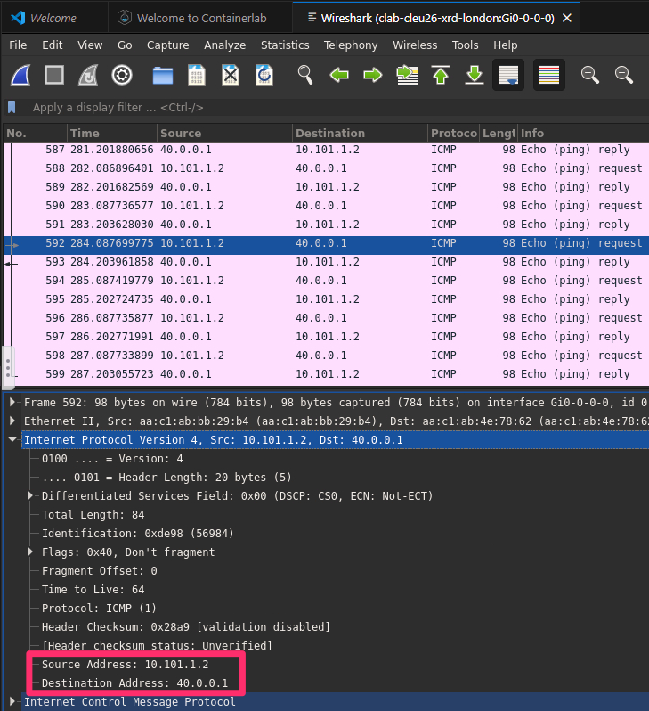
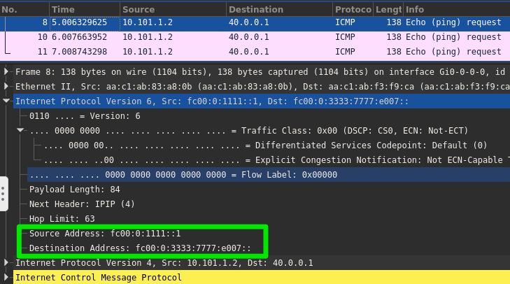
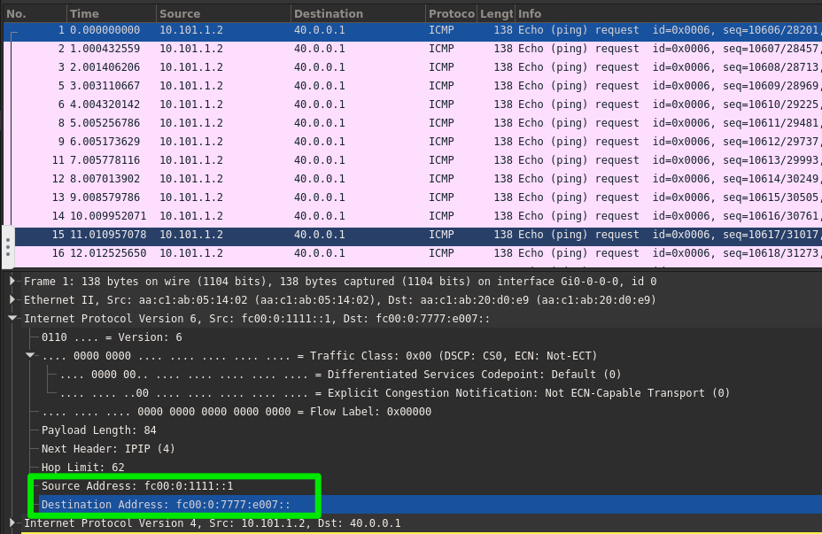
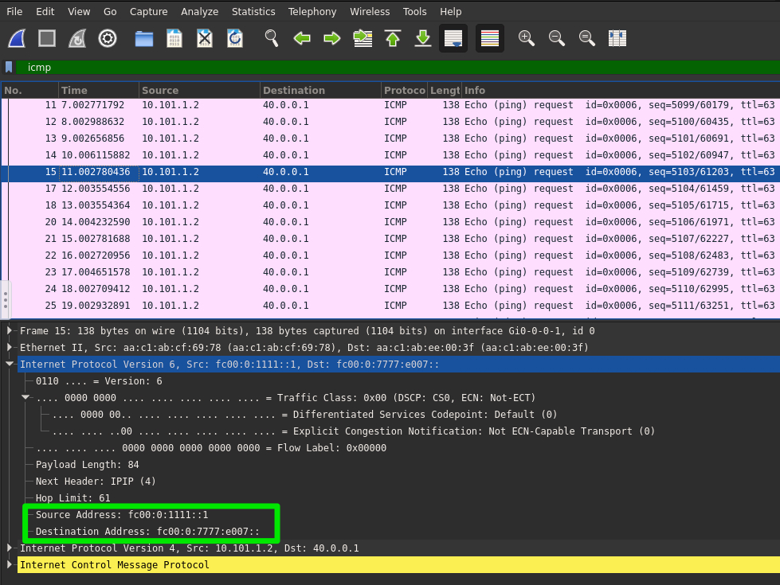

# Lab 2: Configure SRv6 L3VPN and SRv6-TE [20 Min]

> Tip: Attention to detail matters—sometimes the data plane hides more than just packets.

### Description
In Lab 2 we will establish an SRv6 Layer-3 VPN named *`carrots`*.  The *carrots* vrf will include the *London "storage"* and *Rome* containers connected to **london-xrd01** and **rome-xrd07**.  

Once the L3VPN is established we will then setup SRv6-TE traffic steering from *London* such that traffic to *Rome* prefix *`40.0.0.0/24`* will take a different path than traffic to Rome prefix *`50.0.0.0/24`*.

## Contents
- [Lab 2: Configure SRv6 L3VPN and SRv6-TE \[20 Min\]](#lab-2-configure-srv6-l3vpn-and-srv6-te-20-min)
    - [Description](#description)
  - [Contents](#contents)
  - [Lab Objectives](#lab-objectives)
  - [Topology](#topology)
  - [Configure SRv6 L3VPN](#configure-srv6-l3vpn)
    - [Configure SRv6 L3VPN on rome-xrd07](#configure-srv6-l3vpn-on-rome-xrd07)
    - [Validate SRv6 L3VPN](#validate-srv6-l3vpn)
  - [Configure SRv6-TE steering for L3VPN](#configure-srv6-te-steering-for-l3vpn)
    - [Create SRv6-TE steering policy](#create-srv6-te-steering-policy)
    - [Validate SRv6-TE steering of L3VPN traffic and Packet Walk.](#validate-srv6-te-steering-of-l3vpn-traffic-and-packet-walk)
  - [End of Lab 2](#end-of-lab-2)

## Lab Objectives
We will have achieved the following objectives upon completion of Lab 2:

* Configure and validate SRv6 L3VPN
* Configuration and testing of SRv6 TE policy and traffic steering

## Topology


## Configure SRv6 L3VPN
The SRv6-based IPv4/IPv6 L3VPN featureset enables operation of IPv4/IPv6 L3VPN over a SRv6 data plane. Traditionally L3VPN has been operated over MPLS or SR-MPLS. SRv6 L3VPN uses the locator/function aspect of SRv6 Segment IDs (SIDs) instead of PE + VPN labels. 

Example: 

|     Locator    | Function |                                         
|:---------------|:--------:|
| fc00:0000:7777:|   e004:: |


In this lab a BGP L3VPN SID will be allocated in per-VRF mode and provides End.DT4 or End.DT6 functionality. End.DT4/6 represents the Endpoint with decapsulation and IPv4 or v6 lookup in a specific VRF table.

For more details on SRv6 network programming Endpoint Behavior functionality please see RFC 8986 [LINK](https://datatracker.ietf.org/doc/html/rfc8986#name-enddt6-decapsulation-and-sp)

BGP encodes the SRv6 SID in the prefix-SID attribute of the IPv4/6 L3VPN Network Layer Reachability Information (NLRI) and advertises it via it's MP-BGP peers. The Ingress PE (provider edge) router encapsulates the VRF IPv4/6 traffic with the SRv6 VPN SID and sends it over the SRv6 network.

The *carrots* VRFs is setup on the two edge routers in our SP network: **london-xrd01** and **rome-xrd07**. Intermediate routers do not need to be VRF aware and are instead forwarding on the SRv6 data plane. *(technically the intermediate routers don't need to be SRv6 aware and could simply perform IPv6 forwarding based on the outer IPv6 header)*.  

The VRF instances and their interfaces have been preconfigured, allowing us to focus on the SRv6 BGP configuration. 

Optional: if you wish to see the existing VRF configuration run these commands on *rome-xrd07*:
```
show run vrf
show run interface GigabitEthernet 0/0/0/0
```

### Configure SRv6 L3VPN on rome-xrd07

We'll start with **rome-xrd07** as it will need a pair of static routes for reachability to the  **Rome container's** "40" and "50" network prefixes (loopback interfaces). Later we'll create SRv6-TE steering policies for traffic to the "40" and "50" prefixes:  

> [!NOTE]
> All of the below commands are also available in the *`quick config doc.`*. Be aware that the quick config document contains both the L3VPN configuration as well as the L3VPN TE configuration. [HERE](https://github.com/cisco-asp-web/LTRSPG-2212/blob/main/lab_2/lab_2_quick_config.md) 

   
1. **rome-xrd07** vrf static route configuration
   
   SSH into rome-xrd07 and copy/paste the static route config below the image:

   **rome-xrd07**
   ```yaml
      conf t
      
      router static
        vrf carrots
          address-family ipv4 unicast
            40.0.0.0/24 10.107.1.2
            50.0.0.0/24 10.107.1.2
          commit
    ```
2. Verify **Rome** VRF prefix reachability  
    Ping check from Rome-xrd07 gi 0/0/0/0 to Rome's Container NIC:  
    ```
    ping vrf carrots 10.107.1.1
    ping vrf carrots 40.0.0.1
    ping vrf carrots 50.0.0.1
    ping vrf carrots fc00:0:107:1::2
    ```

3. Enable BGP L3VPN on **rome-xrd07**
   
     The *carrots* L3VPN is dual-stack so we will be adding both vpnv4 and vpnv6 address-families to the BGP neighbor-group for ipv6 peers. For example you will enable L3VPN in the neighbor-group template by issuing the *address-family vpnv4/6 unicast* command. 

    **Rome-xrd07**
    ```yaml
    conf t
    router bgp 65000
      neighbor-group xrd-ipv6-peer
        address-family vpnv4 unicast
        next-hop-self

        address-family vpnv6 unicast
        next-hop-self
      commit
    ```

4. Enable SRv6 for VRF carrots and redistribute connected/static
   
    Next we add VRF *carrots* into BGP and enable SRv6 to the IPv4 and IPv6 address family with the command *`segment-routing srv6`*. In addition we will tie the VRF to the SRv6 locator *`MyLocator`* configured in Lab 1.

    On **rome-xrd07** we will need to redistribute both the connected and static routes to provide reachability to Rome and its additional prefixes. Therefore, we will add *`redistribute static`* for VRF *carrots*.

    **rome-xrd07**  
    ```yaml
    conf t
    router bgp 65000
      vrf carrots
        rd auto
        address-family ipv4 unicast
          segment-routing srv6
          locator MyLocator
          alloc mode per-vrf
          redistribute static
          redistribute connected
      
        address-family ipv6 unicast
          segment-routing srv6
          locator MyLocator
          alloc mode per-vrf
          redistribute static
          redistribute connected
      commit
      ```
### Configure SRv6 L3VPN on xrd01 and RR xrd05

1. Using the visual code extension, ssh to **london-xrd01** and apply the configuration in a single step:

    ```yaml
    conf t

    router bgp 65000
    neighbor-group xrd-ipv6-peer
      address-family vpnv4 unicast
      next-hop-self
      
      address-family vpnv6 unicast
      next-hop-self
      
    vrf carrots
      rd auto
      address-family ipv4 unicast
      segment-routing srv6
        locator MyLocator
        alloc mode per-vrf
      redistribute connected
      
      address-family ipv6 unicast
      segment-routing srv6
        locator MyLocator
        alloc mode per-vrf
      redistribute connected
    commit
    ```

#### Route Reflectors Configuration 
   
The BGP route reflectors **paris-xrd05** and **barcelona-xrd06** also need L3VPN configuration added to their peering group. In order to save some time we've preconfigured both with this:

```yaml
    conf t
    
    router bgp 65000
    neighbor-group xrd-ipv6-peer
      address-family vpnv4 unicast
      route-reflector-client
      
      address-family vpnv6 unicast
      route-reflector-client
    commit
```


### Validate SRv6 L3VPN

Validation command output examples can be found at this [LINK](/lab_2/validation-cmd-output.md)
> [!NOTE]
> It can take a few seconds after configuration before you see routes populate through the network and be visible in the routing tables.


> [!IMPORTANT]
> From **london-xrd01** run the following set of validation commands (for the sake of time you can paste them in as a group, or spot check some subset of commands). 

   ```
   show segment-routing srv6 sid
   show bgp vpnv4 unicast
   show bgp vrf carrots 40.0.0.0/24
   show bgp vpnv6 unicast
   ping vrf carrots 40.0.0.1
   ping vrf carrots 50.0.0.1
   ```
   
   Example validation for vpnv4 route
   ```diff
   RP/0/RP0/CPU0:london#show bgp vrf carrots 40.0.0.0/24   
   Tue Jan 31 23:36:41.390 UTC
   +BGP routing table entry for 40.0.0.0/24, Route Distinguisher: 10.0.0.7:1   <--- WE HAVE A ROUTE. YAH
   Versions:
     Process           bRIB/RIB  SendTblVer
     Speaker                  11           11
   Last Modified: Jan 31 23:34:44.948 for 00:01:56
     Paths: (1 available, best #1)
     Not advertised to any peer
     Path #1: Received by speaker 0
     Not advertised to any peer
     Local
   +    fc00:0:7777::1 (metric 3) from fc00:0:5555::1 (10.0.0.7)   <--------- SOURCE xrd07
   +      Received Label 0xe0040     <-------- SRv6 Function "e004"
         Origin incomplete, metric 0, localpref 100, valid, internal, best, group-best, import-candidate, not-in-vrf
         Received Path ID 0, Local Path ID 1, version 5
         Extended community: RT:9:9 
   +      Originator: 10.0.0.7, Cluster list: 10.0.0.5             <------- FROM RR xrd05
         PSID-Type:L3, SubTLV Count:1
         SubTLV:
   +        T:1(Sid information), Sid:fc00:0:7777::, Behavior:63, SS-TLV Count:1   <-- SRv6 Locator for source node
           SubSubTLV:
             T:1(Sid structure):
         Source AFI: VPNv4 Unicast, Source VRF: default, Source Route Distinguisher: 10.0.0.7:0
   ```

## Configure SRv6-TE steering for L3VPN
**Rome's** L3VPN IPv4 prefixes are associated with two classes of traffic:

* The **"40"** destination (40.0.0.0/24) is bulk transport destination (content replication or data backups) and thus latency and loss tolerant. 
  
* The **"50"** destination (50.0.0.0/24) is for real time traffic (live video, etc.) and thus require the lowest latency path available.

We will use the below diagram for reference:


> [!IMPORTANT]
> A subsequent section of this lab will validate end-to-end connectivity between the London and Rome containers, providing a detailed, step-by-step walkthrough of traffic forwarding across the network from ingress to egress.

### Create SRv6-TE steering policy
For our SRv6-TE purposes we'll leverage the on-demand nexthop (ODN) feature set. Here is a nice example and explanation of ODN: [HERE](https://xrdocs.io/design/blogs/latest-converged-sdn-transport-ig)

In our lab we will configure **rome-xrd07** as the egress PE router with the ODN method. This will trigger **rome-xrd07** to advertise its L3VPN routes with *`color extended communities`*. We'll do this by first defining the *`extcomms`*, then setting up route-policies to match on destination prefixes and set the *`extcomm`* values.

The ingress PE, **london-xrd01**, will then be configured with SRv6 segment-lists and SRv6 ODN steering policies that match routes with the respective color and apply the appropriate SID stack on outbound traffic.

1. Prior to configuring SRv6-TE policy lets get a baseline look at our vpvn4 route as viewed from **london-xrd01**
   Run the following command:
   ```
   show bgp vpnv4 uni vrf carrots 40.0.0.0/24
   ```

   ```diff
   RP/0/RP0/CPU0:london#show bgp vpnv4 uni vrf carrots 40.0.0.0/24
   <snip> 
     Local
       fc00:0:7777::1 (metric 3) from fc00:0:5555::1 (10.0.0.7)
        Received Label 0xe0060
         Origin incomplete, metric 0, localpref 100, valid, internal, best, group-best, import-candidate, imported
         Received Path ID 0, Local Path ID 1, version 63
   +     Extended community: RT:9:9 <- NO COLOR OPTION APPLIED
         Originator: 10.0.0.7, Cluster list: 10.0.0.5
         PSID-Type:L3, SubTLV Count:1
          SubTLV:
          T:1(Sid information), Sid:fc00:0:7777::(Transposed), Behavior:63, SS-TLV Count:1
               SubSubTLV:
             T:1(Sid structure):
         Source AFI: VPNv4 Unicast, Source VRF: default, Source Route Distinguisher: 10.0.0.7:1
   ```
      
2. On **rome-xrd07** configure ext-comms, route-policies, and BGP such that *rome-xrd07* advertises Rome's "40" and "50" prefixes with their respective color extended communities:

   Using the visual code extension, SSH into *rome-xrd07* and paste the following commands:

   ```yaml
   conf t
   extcommunity-set opaque bulk-transfer
     40
   end-set
 
   extcommunity-set opaque low-latency
     50
   end-set

   route-policy set-color
     if destination in (40.0.0.0/24) then
       set extcommunity color bulk-transfer
     endif
     if destination in (50.0.0.0/24) then
       set extcommunity color low-latency
     endif
     pass
   end-policy

   router bgp 65000
   neighbor-group xrd-ipv6-peer
     address-family vpnv4 unicast
     route-policy set-color out
    
     address-family vpnv6 unicast
     route-policy set-color out
   commit
   ```

4. Validate vpnv4 prefixes are received at **london-xrd01** and that they have their color extcomms:
   

   Using the visual code extension, SSH into xrd01 and paste the following commands:


   ```
   show bgp vpnv4 uni vrf carrots 40.0.0.0/24 
   show bgp vpnv4 uni vrf carrots 50.0.0.0/24
   ```
   
   Example:
   ```diff
   RP/0/RP0/CPU0:london#show bgp vpnv4 uni vrf carrots 40.0.0.0/24
    <snip>
     Local
       fc00:0:7777::1 (metric 3) from fc00:0:5555::1 (10.0.0.7)
         Received Label 0xe0060
         Origin incomplete, metric 0, localpref 100, valid, internal, best, group-best, import-candidate, imported
         Received Path ID 0, Local Path ID 1, version 67
   +     Extended community: Color:40 RT:9:9  <- COLOR 40 APPLIED
         Originator: 10.0.0.7, Cluster list: 10.0.0.5
         PSID-Type:L3, SubTLV Count:1
          SubTLV:
           T:1(Sid information), Sid:fc00:0:7777::(Transposed), Behavior:63, SS-TLV Count:1
            SubSubTLV:
             T:1(Sid structure):
         Source AFI: VPNv4 Unicast, Source VRF: default, Source Route Distinguisher: 10.0.0.7:1
   ```

2. On **london-xrd01** configure a pair of SRv6-TE segment lists for steering traffic over these specific paths through the network: 
    - Segment list *xrd2347* will execute the explicit path: xrd01 -> 02 -> 03 -> 04 -> 07
    - Segment list *xrd567* will execute the explicit path: xrd01 -> 05 -> 06 -> 07

   **london-xrd01**
   ```yaml
   conf t
   segment-routing
    traffic-eng
     segment-lists
      srv6
       sid-format usid-f3216
      
      segment-list xrd2347
       srv6
        index 10 sid fc00:0:2222::
        index 20 sid fc00:0:3333::
        index 30 sid fc00:0:4444::

      segment-list xrd567
       srv6
        index 10 sid fc00:0:5555::
        index 20 sid fc00:0:6666::
     commit
   ```

3. On **london-xrd01** configure our bulk transport and low latency SRv6 steering policies. Low latency traffic will be forced over the *xrd01-05-06-07* path, and bulk transport traffic will take the longer *xrd01-02-03-04-07* path:
  
   **london-xrd01**
   ```yaml
   conf t
   segment-routing
   traffic-eng

     policy bulk-transfer
     srv6
       locator MyLocator binding-sid dynamic behavior ub6-insert-reduced
     
     color 40 end-point ipv6 fc00:0:7777::1
     candidate-paths
       preference 100
       explicit segment-list xrd2347
      
     policy low-latency
     srv6
       locator MyLocator binding-sid dynamic behavior ub6-insert-reduced
    
     color 50 end-point ipv6 fc00:0:7777::1
     candidate-paths
       preference 100
       explicit segment-list xrd567
     commit
   ```

4. Validate **london-xrd01's** SRv6-TE SID policy is enabled and up:
   ```
    show segment-routing srv6 sid
   ```
   
   Example output, note the additional uDT VRF carrots and SRv6-TE **uB6 Insert.Red** SIDs added to the list:
   ```diff
   RP/0/RP0/CPU0:london#  show segment-routing srv6 sid
   Sat Dec 16 02:45:31.772 UTC
 
   *** Locator: 'MyLocator' *** 

   SID                         Behavior          Context                            Owner               State  RW
   --------------------------  ----------------  --------------------------------   ------------------  -----  --
    fc00:0:1111::               uN (PSP/USD)      'default':4369                     sidmgr              InUse  Y 
    fc00:0:1111:e000::          uA (PSP/USD)      [Gi0/0/0/1, Link-Local]:0:P        isis-100            InUse  Y 
    fc00:0:1111:e001::          uA (PSP/USD)      [Gi0/0/0/1, Link-Local]:0          isis-100            InUse  Y 
    fc00:0:1111:e002::          uA (PSP/USD)      [Gi0/0/0/2, Link-Local]:0:P        isis-100            InUse  Y 
    fc00:0:1111:e003::          uA (PSP/USD)      [Gi0/0/0/2, Link-Local]:0          isis-100            InUse  Y 
    fc00:0:1111:e004::          uDT6              'default'                          bgp-65000           InUse  Y 
    fc00:0:1111:e005::          uDT4              'default'                          bgp-65000           InUse  Y 
    fc00:0:1111:e008::          uDT4              'carrots'                          bgp-65000           InUse  Y 
    fc00:0:1111:e009::          uDT6              'carrots'                          bgp-65000           InUse  Y
   +fc00:0:1111:e006::          uB6 (Insert.Red)  'srte_c_50_ep_fc00:0:7777::1' (50, fc00:0:7777::1)  xtc_srv6            InUse  Y 
   +fc00:0:1111:e007::          uB6 (Insert.Red)  'srte_c_40_ep_fc00:0:7777::1' (40, fc00:0:7777::1)  xtc_srv6            InUse  Y  
   ```

   Take a look at the SRv6-TE policy detail:
   ```
    show segment-routing traffic-eng policy
   ```
   
   ```diff
   RP/0/RP0/CPU0:london#show segment-routing traffic-eng policy color 40
   SR-TE policy database
   ---------------------

   Color: 40, End-point: fc00:0:7777::1
     Name: srte_c_40_ep_fc00:0:7777::1
       Status:
   +      Admin: up  Operational: up for 00:09:43 (since Jan 23 17:37:50.369)
       Candidate-paths:
        Preference: 100 (configuration) (active)
         Name: bulk-transfer
         Requested BSID: dynamic
         Constraints:
           Protection Type: protected-preferred
           Maximum SID Depth: 25
   +     Explicit: segment-list xrd2347 (valid)
           Weight: 1, Metric Type: TE
             SID[0]: fc00:0:2222::/48
                     Format: f3216
                     LBL:32 LNL:16 FL:0 AL:80
             SID[1]: fc00:0:3333::/48
                     Format: f3216
                     LBL:32 LNL:16 FL:0 AL:80
             SID[2]: fc00:0:4444::/48
                     Format: f3216
                     LBL:32 LNL:16 FL:0 AL:80
         SRv6 Information:
           Locator: MyLocator
           Binding SID requested: Dynamic
           Binding SID behavior: uB6 (Insert.Red)
     Attributes:
   +    Binding SID: fc00:0:1111:e007::
       Forward Class: Not Configured
       Steering labeled-services disabled: no
       Steering BGP disabled: no
       IPv6 caps enable: yes
       Invalidation drop enabled: no
       Max Install Standby Candidate Paths: 0
       Path Type: SRV6
   ```
   
   Show the BGP vpnv4 prefix entry and note the addition the SR policy and binding-SID:
   ```
    show bgp vpnv4 uni vrf carrots 40.0.0.0/24 
   ```   
   ```diff
   RP/0/RP0/CPU0:london#show bgp vpnv4 uni vrf carrots 40.0.0.0/24
    <snip>
     Local
       fc00:0:7777::1 (metric 3) from fc00:0:5555::1 (10.0.0.7)
         Received Label 0xe0040
         Origin incomplete, metric 0, localpref 100, valid, internal, best, group-best, import-candidate, imported
         Received Path ID 0, Local Path ID 1, version 30
   +     Extended community: Color:40 RT:9:9                      
         Originator: 10.0.0.7, Cluster list: 10.0.0.5
   +     SR policy color 40, up, not-registered, bsid fc00:0:1111:e007::   <---- Newly Configured Color Policy 
   
         PSID-Type:L3, SubTLV Count:1
         SubTLV:
           T:1(Sid information), Sid:fc00:0:7777::, Behavior:63, SS-TLV Count:1
           SubSubTLV:
             T:1(Sid structure):
         Source AFI: VPNv4 Unicast, Source VRF: default, Source Route Distinguisher: 10.0.0.7:1
   ```
### Validate SRv6-TE steering of L3VPN traffic and Packet Walk.

In the previous section, we validated the SRv6 control plane, confirming that color-based SR policies, Binding SIDs, and segment lists were correctly programmed between the London and Rome sites. We now move to data-plane validation, focusing on how traffic originating from the London container is actually forwarded across the network toward the Rome container. Using SRv6 color-based policies, packets are steered along explicitly engineered paths, independent of default IGP routing. Two traffic intents are validated: a bulk-transfer path and a low-latency path, each traversing a different set of intermediate nodes. By observing packet forwarding and captures along the path, we validate how control-plane intent is enforced in the data plane through SRv6 Binding SIDs and segment lists.

**Validate bulk traffic takes the non-shortest path: london-xrd01 -> 02 -> 03 -> 04 -> rome-xrd07** 

In SRv6 Traffic Engineering, uSIDs allow a source node (ingress PE, London-XRD01 in this case) to explicitly program a packet’s path through a domain by enforcing a sequence of intermediate waypoints or links.

The following diagram illustrates the expected traffic path and highlights the different capture points that will be demonstrated.



1. Using the Visual Code extension, ssh to the **London container's** shell and run a ping to the bulk transport destination IPv4 address on Rome. We will capture and analyze this traffic at multiple points across the network.


  Launch an edgeshark capture on the **london-xrd01** container interface Gig0/0/0/0 to inspect the traffic.


  Observing the ICMP traffic exchanged between the London and Rome containers, the echo request is a standard IPv4 packet sourced from 10.101.1.2 and destined for 40.0.0.1, with a measured round-trip time of approximately 120 ms. This latency matches the delay values that were intentionally introduced on the links using Ansible in Lab 1, confirming that traffic is traversing the expected network path.




2. Lets now tie the SRv6 TE policy configured to what we expect to see in the Edgeshark output. What you're looking for in the below output is the translation of the previously configured SRv6 TE policy reflected in the actual SRv6 packet header. So the TE bulk policy configured was:

   ```
      segment-list xrd2347
       srv6
        index 10 sid fc00:0:2222::
        index 20 sid fc00:0:3333::
        index 30 sid fc00:0:4444::
   ```
   And we expect to see in the packet header the follow tag order shown below in the capture output:
   ```
   2222:3333:7777
   ```

> [!IMPORTANT]
> Notice that the above SID stack the last hop **zurich-xrd04** (4444). As mentioned in the lecture XR looks at the penultimate hop and does a calculation using the ISIS topology table and determines that **berlin-xrd03's** best forwarding path to **rome-xrd07** (7777) is through **xrd04**. Therefore for efficiency it drops the penultimate hop off the SID stack.

    
3. Launch an edgeshark capture on container **london-xrd01** interface Gig0/0/0/1 to inspect the traffic.
   
    
   
   Here is a visual representation of our capture :
   
    
   
   If we focus on the IPv6 header (Outer Header - SRv6 transport layer) we can see the following:


   - Source IPv6: fc00:0:1111::1 
   - Destination IPv6: fc00:0:2222:3333:7777:e006:: which defines the SRv6 segment created earlier for traffic steering accross xrd02, xrd03, xrd04 and xrd07
    
In SRv6 Traffic Engineering, uSIDs allow a source node (ingress PE) to explicitly program a packet’s path through a domain by enforcing a sequence of intermediate waypoints or links. Like all Segment Routing, uSID-based TE is stateless; the entire path and service instructions are encoded in the packet header, meaning transit routers do not need to maintain per-flow state.
Standard SRv6 requires a 128-bit SID for every hop, which can lead to large packet headers
uSIDs solve this by packing six hops into a single address, allowing complex TE paths to be executed without a Segment Routing Header (SRH) in most use cases.

On-Demand Next-Hop (ODN) allows the headend to instantiate an SR Policy dynamically only when it receives a service route with a specific color. This eliminates the need to pre-configure "full mesh" tunnels, significantly improving scalability.


4. Launch an edgeshark capture on container **berlin-xrd03** interface Gig0/0/0/0 to inspect the traffic.

  

Like in the previous steps, we need to focus on the IPv6 header (Outer Header - SRv6 transport layer):

   - Source IPv6: fc00:0:1111::1 
   - Destination IPv6: fc00:0::3333:7777:e007:: which defines a modified version of the SRv6 segment created earlier for traffic steering accross xrd02, xrd03, xrd04 and xrd07

Unlike MPLS, which pops labels from a stack, SRv6 microSIDs operate by directly modifying the IPv6 destination address to expose the next forwarding instruction. At each hop, the active uSID is consumed by shifting the remaining uSID fields within the destination address, effectively removing the current instruction and advancing the next one. In this lab, the uSID 2222 is consumed at XRD02, resulting in a destination address of fc00:0::3333:7777:e007:: downstream, confirming correct hop-by-hop execution of the SRv6 data plane.


5. Launch an edgeshark capture on container **zurich-xrd04** interface Gig0/0/0/0 to inspect the traffic.

  

Here, the zurich xrd router (XRD04 – 4444) receives a packet whose IPv6 destination address contains the microSID of the final destination (7777) rather than its own, and therefore forwards the packet as standard IPv6 traffic toward the endpoint.

- No SRv6 Processing: The router does not perform any "Shift" operations because the Destination Address does not match any of its locally configured SRv6 SIDs.
- Longest Prefix Match (LPM): The router performs a standard Longest Prefix Match lookup on the Destination Address.
- Forwarding: It finds the route to the final destination (the egress PE or next endpoint) and forwards the packet out the appropriate interface


6. Launch an edgeshark capture on container **rome-xrd07** interface Gig0/0/0/1 to inspect the traffic sent by **Zurich-xrd04**.

  

When Rome receives the packet with an IPv6 destination address of fc00:0:7777:e007::, the active microSID (7777) matches Rome’s own uSID, indicating that the packet has reached its final SRv6 endpoint. At this stage, all transit microSIDs have already been consumed, and no further traffic steering is required. Rome therefore executes the endpoint service behavior associated with e007 (for example, uDT4/uDT6: More information [here](https://www.ciscolive.com/c/dam/r/ciscolive/emea/docs/2025/pdf/BRKSPG-2203.pdf) and [here](https://datatracker.ietf.org/doc/html/rfc8986#name-enddt6-decapsulation-and-sp)), decapsulates the packet as needed, and forwards the inner payload according to the local routing or VRF configuration.


7. Launch an edgeshark capture on container **rome-xrd07** interface Gig0/0/0/0 to inspect the traffic.

  

At the Rome router, the SRv6 transport header has been fully processed and removed, and the packet is delivered to the endpoint service. As shown in this capture, only a standard IPv4 ICMP packet remains, sourced from 10.101.1.2 and destined for 40.0.0.1, confirming that the SRv6 encapsulation has been decapsulated. This behavior corresponds to the execution of the SRv6 uDT4 endpoint function, which forwards the packet into the correct routing context . The packet is then forwarded within the Carrots VRF, completing the end-to-end SRv6 packet walk from London to Rome.


---
<!-- 
EASTER_EGG:
fc00:0:2212:3333:7777:8986::
If you found this, explain what this uSID represents and why RFC 8986 matters here.
-->


**Validate low latency traffic takes the path: london-xrd01 -> 05 -> 06 -> rome-xrd07**

1.  Start a new edgeshark capture  **london-xrd01's** outbound interface (Gi0-0-0-2) to **paris-xrd05**:

2.  Let's test and validate that our SRv6 TE policy is applied on **london-xrd01**. From **app-container-london** we will ping **Rome's** low latency IPv4 destination:
    ```
    ping 50.0.0.1 -i .5
    ```

     


    Note the explicit segment-list we configured for our low latency policy:

    ```
    segment-list xrd567
       srv6
         index 10 sid fc00:0:5555::
         index 20 sid fc00:0:6666::
    ```

    Normally we might expect the tcpudmp output to show *5555:6666:7777* in the packet header, however, when the XRd headend router performs its SRv6-TE policy calculation it recognized that **paris-xrd05's** best path to **rome-xrd07** is through **barcelona-xrd06**, so it doesn't need to include the *6666* in the SID stack.


## End of Lab 2
Please proceed to [Lab 3](https://github.com/cisco-asp-web/LTRSPG-2212/blob/main/lab_3/lab_3-guide.md)
