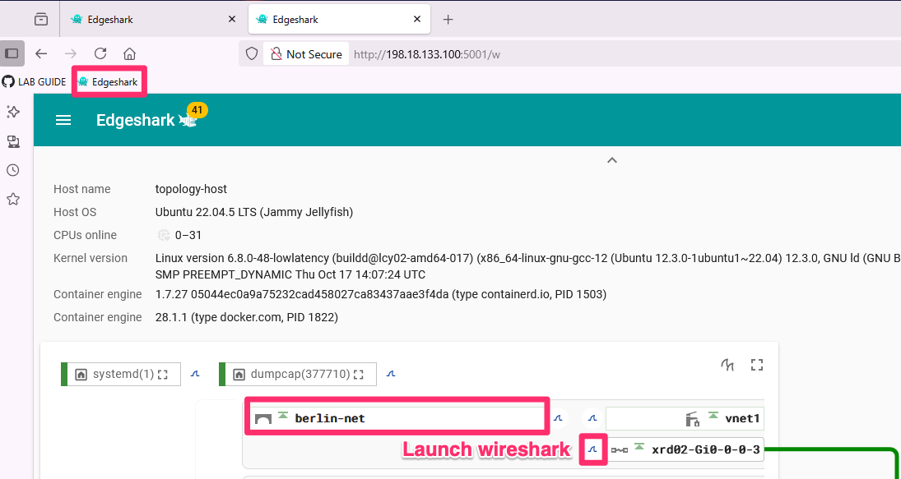

# Lab 3: SRv6 for Kubernetes with Cilium [30 Min]

### Description
Now that we've established SRv6 L3VPNs across our network, we're going to transition from **router-based SRv6** to **host-based SRv6**. Our first step will be to enable *SRv6 L3VPN for Kubernetes*. The London VMs have Kubernetes pre-installed and are running the *Cilium CNI* (Container Network Interface). In this lab we'll review some basic Kubernetes commands (kubectl) and then we'll setup Cilium BGP peering with our XRd route reflectors. After that we'll configure Cilium's SRv6 SID manager and Locator pool. Finally we'll add a couple containers to our London K8s cluster and join them to the carrots VRF.

> [!NOTE]
> This portion of the lab makes use of Cilium Enterprise as the SRv6 features are in Beta and not available in the open source version. If you are interested in SRv6 on Cilium or other Enterprise features, please contact the relevant Cisco Isovalent sales team.  

Isovalent has also published a number of labs covering a wide range of Cilium, Hubble, Tetragon, and Isovalent Load Balancer products and capabilities here:

https://cilium.io/labs/


## Contents
- [Lab 3: SRv6 for Kubernetes with Cilium \[30 Min\]](#lab-3-srv6-for-kubernetes-with-cilium-30-min)
    - [Description](#description)
  - [Contents](#contents)
  - [Lab Objectives](#lab-objectives)
  - [Verify pre-installed Kubernetes and Cilium are running](#verify-pre-installed-kubernetes-and-cilium-are-running)
  - [Setup Cilium BGP Peering](#setup-cilium-bgp-peering)
    - [Cilium BGP CRD](#cilium-bgp-crd)
    - [Establish the Cilium BGP global and peer configurations](#establish-the-cilium-bgp-global-and-peer-configurations)
    - [Verify Cilium BGP peering](#verify-cilium-bgp-peering)
    - [Cilium BGP prefix advertisement](#cilium-bgp-prefix-advertisement)
    - [Create the carrots BGP VRF](#create-the-carrots-bgp-vrf)
  - [Cilium SRv6 SID Manager and Locators](#cilium-srv6-sid-manager-and-locators)
  - [Establish Cilium VRFs and Create Pods](#establish-cilium-vrfs-and-create-pods)
    - [Verify Cilium advertised L3vpn prefixes are reaching remote xrd nodes](#verify-cilium-advertised-l3vpn-prefixes-are-reaching-remote-xrd-nodes)
    - [Run a ping test!](#run-a-ping-test)
    - [Optional - Traffic capture using Edgeshark](#optional---traffic-capture-using-edgeshark)
  - [Lab 3 Appendix](#lab-3-appendix)
  - [End of lab 3](#end-of-lab-3)

## Lab Objectives
We will have achieved the following objectives upon completion of Lab 3:

* Understanding of Cilium networking for Kubernetes
* Understanding on how to configure Cilium BGP
* Understanding on how to configure Cilium VRFs
* Understanding on how to configure Cilium SRv6

  
## Verify pre-installed Kubernetes and Cilium are running

Kubernetes and Cilium Enterprise are pre-installed on the **London** VMs. All of the following steps are to be performed on the **london-vm-00** control plane node unless otherwise specified.

1. From a **topology-host** terminal session SSH into the **london-vm-00** and cd into the lab_3/cilium directory
   ```
   ssh cisco@london-vm-00

   ```
   ```
   cd ~/LTRSPG-2212/lab_3/cilium/
   ```

2. Run a couple commands to verify the K8s cluster and the Cilium Installation

   Display k8s nodes:
   ```
   kubectl get nodes -o wide
   ```
   
   The ouput should look something like:
   ```yaml
   $ kubectl get nodes -o wide
   NAME           STATUS   ROLES           AGE     VERSION   INTERNAL-IP   EXTERNAL-IP   OS-IMAGE             KERNEL-VERSION       CONTAINER-RUNTIME
   london-vm-00   Ready    control-plane   6d      v1.35.0   10.8.0.2      <none>        Ubuntu 22.04.5 LTS   5.15.0-164-generic   containerd://1.7.27
   london-vm-01   Ready    <none>          2d23h   v1.31.8   10.8.1.2      <none>        Ubuntu 22.04.5 LTS   5.15.0-164-generic   containerd://1.7.27
   london-vm-02   Ready    <none>          2d23h   v1.31.8   10.8.2.2      <none>        Ubuntu 22.04.5 LTS   5.15.0-164-generic   containerd://1.7.27
   ```

   Display Cilium pods:
   ```
   kubectl get pods -n kube-system | grep cilium
   ```
   The output should look something like this:
   ```yaml
   $ kubectl get pods -n kube-system | grep cilium
   cilium-envoy-4nmml                     1/1     Running   3 (4h36m ago)   5d23h
   cilium-envoy-5k2k7                     1/1     Running   2 (4h59m ago)   2d23h
   cilium-envoy-6n7tg                     1/1     Running   2 (4h59m ago)   2d23h
   cilium-h6f79                           1/1     Running   1 (4h59m ago)   2d10h
   cilium-node-init-7fkxn                 1/1     Running   2 (4h59m ago)   2d23h
   cilium-node-init-vqp5s                 1/1     Running   3 (4h36m ago)   5d23h
   cilium-node-init-zcsh6                 1/1     Running   2 (4h59m ago)   2d23h
   cilium-operator-74c5c6c5f6-cwjd7       1/1     Running   7 (4h9m ago)    5d23h
   cilium-operator-74c5c6c5f6-hhd4n       1/1     Running   3 (4h36m ago)   5d23h
   cilium-rc6cd                           1/1     Running   1 (4h59m ago)   2d10h
   cilium-vslzk                           1/1     Running   2 (4h36m ago)   2d10h
   ```

  Notes on the pods:
  * `Cilium-envoy`: used as a host proxy for enforcing HTTP and other L7 policies as specified in network policies for the cluster. For further reading see: https://docs.cilium.io/en/latest/security/network/proxy/envoy/
  * `Cilium-node-init`: used to initialize the node and install the Cilium agent.
  * `Cilium-operator`: used to manage the Cilium agent on the node.
  * `Cilium-h6fz9`: is the Cilium agent on the node, and the element that will perform BGP peering and programming of eBPF SRv6 forwarding policies.


   Display Cilium DaemonSet status:
   ```
   kubectl get ds -n kube-system cilium
   ```
   The output should show three Cilium DaemonSets (ds) available, example:
   ```yaml
   $ kubectl get ds -n kube-system cilium
   NAME     DESIRED   CURRENT   READY   UP-TO-DATE   AVAILABLE   NODE SELECTOR            AGE
   cilium   3         3         3       3            3           kubernetes.io/os=linux   94m
   ```
> [!NOTE]
> A Kubernetes DaemonSet is a feature that ensures a pod runs on all or some nodes in a Kubernetes cluster. DaemonSets are used to deploy background services, such as monitoring agents, network agents (*such as Cilium/eBPF*), log collectors, and storage volumes.

Now we're ready!

##  Setup Cilium BGP Peering
**Brief explanation of Kubernetes Custom Resource Definitions (CRDs)**

Per: https://kubernetes.io/docs/concepts/extend-kubernetes/api-extension/custom-resources/

*A custom resource is an extension of the Kubernetes API that is not necessarily available in a default Kubernetes installation. It represents a customization of a particular Kubernetes installation. However, many core Kubernetes functions are now built using custom resources, making Kubernetes more modular.*

Said another way, CRDs enable us to add, update, or delete Kubernetes cluster elements and their configurations. The add/update/delete action might apply to the cluster as a whole, a node in the cluster, an aspect of cluster networking or the CNI (*aka, the work we'll do in this lab*), or any given element or set of elements within the cluster including pods, services, daemonsets, etc.

A CRD applied to a single element in the K8s cluster would be analogous to configuring BGP on a router. A CRD applied to multiple elements or cluster-wide would be analogous to adding BGP route-reflection to a network as a whole. 

CRDs come in YAML file format and in the next several sections of this lab we'll apply CRDs to the K8s cluster to setup Cilium BGP peering, establish Cilium SRv6 locator ranges, create VRFs, etc.

### Cilium BGP CRD

For the sake of simplicity we'll use iBGP peering between our London K8s nodes and our route reflectors **paris xrd05** and **barcelona xrd06**. 

On **london-vm-00** change to the lab_3/cilium directory and check out the contents
   ```
   cd ~/LTRSPG-2212/lab_3/cilium/
   ll
   ```

   The files we'll be working with are:
   * [01-bgp-cluster.yaml](cilium/01-bgp-cluster.yaml) - Cilium BGP global configuration
   * [02-bgp-peer.yaml](cilium/02-bgp-peer.yaml) - Cilium BGP peer address families and route policies
   * [03-bgp-node-override.yaml](cilium/03-bgp-node-override.yaml) - Cilium BGP node override; we use this to specify the BGP source address
   * [04-bgp-advert.yaml](cilium/04-bgp-advert.yaml) - Cilium BGP prefix advertisement(s), including SRv6 locator prefix(s)
   * [05-bgp-vrf.yaml](cilium/05-bgp-vrf.yaml) - Cilium BGP VRF configuration
   * [06-srv6-locator-pool.yaml](cilium/06-srv6-locator-pool.yaml) - Cilium SRv6 SID manager and Locator pool configuration
   * [07-vrf-carrots.yaml](cilium/07-vrf-carrots.yaml) - Cilium VRF 'carrots' configuration and pods


Here is a portion of our Cilium BGP configuration in CRD form and with notes:

```yaml
apiVersion: isovalent.com/v1alpha1
kind: IsovalentBGPClusterConfig  # the BGP cluster configuration CRD  
metadata:
  name: cilium-bgp 
spec:
  nodeSelector:
    matchExpressions:
    - key: kubernetes.io/hostname
      operator: In                      # apply config to all nodes in the values list
      values:
      - london-vm-00
      - london-vm-01
      - london-vm-02   
  bgpInstances:                         # the k8s cluster could have multiple BGP instances
  - name: "asn65000"                    # for simplicity we're using a single ASN end-to-end
    localASN: 65000
    peers:
    - name: "paris-rr"                  # base peering config
      peerASN: 65000                   
      peerAddress: fc00:0:5555::1       
      peerConfigRef:
        name: "cilium-peer"             # reference to additional peer config in another CRD
    - name: "barcelona-rr"
      peerASN: 65000
      peerAddress: fc00:0:6666::1
      peerConfigRef:
        name: "cilium-peer"
```

One of the great things about CRDs is you can combine all the configuration elements into a single file, or you can break it up into multiple files by configuration element; see [99-cilium-all.yaml](./cilium/99-cilium-all.yaml)

### Establish the Cilium BGP global and peer configurations


1. On **london-vm-00** cd into the Lab 3 cilium directory and apply the *Cilium BGP Cluster Config CRD*. BGP Cluster config establishes our Cilium Node's BGP ASN and base BGP peering with the route reflectors **paris-xrd05** and **barcelona-xrd06**.
   ```
   cd ~/LTRSPG-2212/lab_3/cilium/
   kubectl apply -f 01-bgp-cluster.yaml
   ```

   Expected output:
   ```
   isovalentbgpclusterconfig.isovalent.com/cilium-bgp created
   ```

   Next: The *BGP Peer Config CRD* is where we control address families and other BGP peering or route policies on a per peer or peer-group basis.
   Here is a portion of the BGP Peer Config CRD with notes:
   ```yaml
   metadata:
     name: cilium-peer    # name of the peer-group
   spec:
     families:            # afi/safi address family combinations
       - afi: ipv6
         safi: unicast
         advertisements:
           matchLabels:
             advertise: "bgpv6unicast"   # advertise ipv6 prefixes found in the bgpv6unicast advertisement CRD
       - afi: ipv4
         safi: mpls_vpn  # a bit of a misnomer, but we're advertising SRv6 L3VPN, or the equivalent of vpnv4 unicast in XR
   ```

2. Apply the Cilium BGP Peer Config CRD. 
   ```
   kubectl apply -f 02-bgp-peer.yaml
   ```

   Expected output:
   ```
   isovalentbgppeerconfig.isovalent.com/cilium-peer created
   ```
   
   At this point our peer sessions are not yet established. Next we'll apply the *`localAddress`* parameter which tells Cilium which source address to use for its BGP peering sessions. This knob is comparable to IOS-XR's `update-source` parameter.

   Here is a portion of the node override CRD with notes:
   ```yaml
    metadata:
      name: london-vm-00     # this CRD will apply to the london-vm-00 node
    spec:
      bgpInstances:
        - name: "asn65000"        
          srv6Responder: true     # instructs BGP to advertise the node's SRv6 Locator (to be created a few steps after this)
          peers:
            - name: "paris-rr"                 # must match the name of the peer in the cluster config
              localAddress: fc00:0:800::2     # the source address to use for the peering session
   ```
   
3. Apply the node override CRD:
   ```
   kubectl apply -f 03-bgp-node-override.yaml
   ```

   Expected output:
   ```yaml
   isovalentbgpnodeconfigoverride.isovalent.com/london-vm-00 created
   isovalentbgpnodeconfigoverride.isovalent.com/london-vm-01 created
   isovalentbgpnodeconfigoverride.isovalent.com/london-vm-02 created
   ```

### Verify Cilium BGP peering 

1. Verify Cilium BGP has successfully established peering sessions with **paris xrd05** and **barcelona xrd06** with the following cilium CLI. Note, it may take a few seconds for the peering sessions to establish.
   
   ```
   cilium bgp peers
   ```

   We expect each london VM to have two IPv6 BGP peering sessions established and receiving BGP NLRIs for IPv6 and IPv4/mpls_vpn (aka, SRv6 L3VPN).

   Partial output:
   ```yaml
   $ cilium bgp peers
   Node     Local AS   Peer AS   Peer Address     Session State   Uptime   Family          Received   Advertised
   london-vm-00   65000      65000     fc00:0:5555::1   established     9s       ipv6/unicast    5          0    
                                                                           ipv4/mpls_vpn   5          0    
            65000      65000     fc00:0:6666::1   established     24s      ipv6/unicast    5          0    
                                                                           ipv4/mpls_vpn   5          0  
   ```

   
### Cilium BGP prefix advertisement

We have not added IPv6 prefix advertisements yet, hence a zero value in the *Advertised* output above. Also, **paris-xrd05** and **barcelona-xrd06**'s peering sessions with Cilium inherited the vpnv4 address family configuration during Lab 3 so we don't need to update their configs. 

Here is a portion of the prefix advertisement CRD with notes:
   ```yaml
    metadata:
      name: bgp-ipv6-unicast
      labels:
        advertise: bgpv6unicast     # this label will be used by the peer config CRD for prefixes to advertise
    spec:
      advertisements:                           
        - advertisementType: "SRv6LocatorPool"   # advertise the SRv6 locator pool (to be created a few steps after this)
          selector:
            matchLabels:
              export: "pool0"
        - advertisementType: "PodCIDR"          # advertise the pod CIDR prefix for pods in the default VRF
   ```

1. Apply the BGP ipv6 unicast (global table/default VRF) prefix advertisement CRD:
   ```
   kubectl apply -f 04-bgp-advert.yaml
   ```

2. Verify the prefix advertisement (you should now see a 1 under the ipv6 unicast column):
   ```
   cilium bgp peers
   ```
   ```diff
   $ cilium bgp peers
   Node           Local AS   Peer AS   Peer Address     Session State   Uptime   Family          Received   Advertised
   +london-vm-00   65000      65000     fc00:0:5555::1   established     3m13s    ipv6/unicast    7          1    
                                                                              ipv4/mpls_vpn   4          0    
               65000      65000     fc00:0:6666::1   established     3m13s    ipv6/unicast    7          1    
                                                                              ipv4/mpls_vpn   4          0
   ```                                                                         

3. Let's get a little more detail on advertised prefixes with the `cilium bgp routes` command. Let's first add a -h flag to see our options

   ```
   cilium bgp routes -h
   ```

   Example output:
   ```
   $ cilium bgp routes -h
   Lists BGP routes from all nodes in the cluster

   Usage:
     cilium bgp routes <available | advertised> <afi> <safi> [vrouter <asn>] [peer|neighbor <address>] [flags]
   ```

4. Let's get the advertised prefixes:
   ```
   cilium bgp routes advertised ipv6 unicast
   ```

> [!NOTE]
> The advertised IPv6 network prefix is the assigned IPv6 used by Cilium on each **london VM**. In addtion the *NextHop* address in the output lists the IPv6 interface address that connects to **london xrd01**. You can see this detail if you run the command *`ip addr show dev cilium_host`* and *`ip addr show dev ens4`* respectively.


### Create the carrots BGP VRF
We are now going to apply the BGP configuration for *vrf carrots* per the yaml file here: [05-bgp-vrf.yaml](cilium/05-bgp-vrf.yaml)

Earlier you saw we broke the BGP peering and route advertisement configurations into two separate yaml files. For the VRF we've got both in single file to illustrate the point about config modularity, and to also have one less step to apply. Here is a brief overview of the BGP VRF CRD:
  ```yaml
  ---
  apiVersion: isovalent.com/v1
  kind: IsovalentBGPVRFConfig      # the BGP VRF configuration CRD
  metadata:
    name: carrots-config   # a meta data label / name of the vrf config
  spec:
    families:
      - afi: ipv4        
        safi: mpls_vpn   
        advertisements:
          matchLabels:
            advertise: "bgp-carrots"  # a meta data label / name for the route advertisement - this is analogous to a outbound route policy

  ---
  apiVersion: isovalent.com/v1
  kind: IsovalentBGPAdvertisement      # BGP route advertisement CRD
  metadata:
    name: carrots-adverts     # a meta data label / name for the VRF route advertisement
    labels:
      advertise: bgp-carrots  # a meta data label / name for this particular advertisement
  spec:
    advertisements:
      - advertisementType: "PodCIDR"   # we're going to advertise the k8s pod CIDR or subnet
  ```

1. Apply the carrots BGP VRF configuration:
   ```
   kubectl apply -f 05-bgp-vrf.yaml
   ```

Our Cilium BGP configuration is now complete. Next we'll setup the Cilium SRv6 SID manager and locators.

## Cilium SRv6 SID Manager and Locators
Per Cilium Enterprise documentation:
*The SID Manager manages a cluster-wide pool of SRv6 locator prefixes. You can define a prefix pool using the IsovalentSRv6LocatorPool resource. The Cilium Operator assigns a locator for each node from this prefix.*

So essentially we're going to configure a /40 range from which Cilium will allocate a /48 bit uSID-based locator to each node in the London K8s cluster.

Cilium also supports /64 locators, but for simplicity and consistency with our *xrd* nodes we're going to use the very commonly deployed /48 bit locators. Here is a portion of the yaml file CRD with notes:

   ```yaml
   behaviorType: uSID          # options are uSID or SRH
   prefix: fc00:0:8800::/40    # the larger /40 block from which a /48 would be allocated to each node in the cluster
   structure:
     locatorBlockLenBits: 32   # the uSID block length
     locatorNodeLenBits: 16    # the uSID node length - here 32 + 16 results in our /48 bit Locator
   ```

1. Define and apply a Cilium SRv6 locator pool. The full CRD may be reviewed here: [06-srv6-locator-pool.yaml](cilium/06-srv6-locator-pool.yaml)
  
   ```
   kubectl apply -f 06-srv6-locator-pool.yaml
   ```

   Recall the BGP prefix advertisement CRD included a spec for advertising the SRv6 locator pool as well:
   ```diff
     advertisements:
       - advertisementType: "SRv6LocatorPool"  
         selector:
           matchLabels:
   +          export: "pool0"
   ```

2. Now that we have a local pool to advertise, let's check our BGP advertised prefixes again:
   ```
   cilium bgp routes advertised ipv6 unicast
   ```

   Example partial output, Cilium is now advertising the node's Locator:
   ```diff
   Node           VRouter   Peer             Prefix               NextHop           Age     Attrs
   london-vm-00   65000     fc00:0:5555::1   2001:db8:42::/64     fc00:0:800::2           
                  65000     fc00:0:6666::1   2001:db8:42::/64     fc00:0:800::2            
   +               65000     fc00:0:5555::1   fc00:0:88f7::/48     fc00:0:800::2           
   +               65000     fc00:0:6666::1   fc00:0:88f7::/48     fc00:0:800::2    
   ```

3. Now that we've created locator pool, let's validate it:
   ```
   kubectl get sidmanager -o yaml
   ```
   
   Or for a more concise output:
   ```
   kubectl get sidmanager -o custom-columns="NAME:.metadata.name,ALLOCATIONS:.spec.locatorAllocations"
   ```

   The truncated output below shows the Cilium uSID locator allocation for each node:

   Example output:

   ```yaml
   NAME           ALLOCATIONS
   london-vm-00   [map[locators:[map[behaviorType:uSID prefix:fc00:0:88f7::/48
   london-vm-01   [map[locators:[map[behaviorType:uSID prefix:fc00:0:88f6::/48 
   london-vm-02   [map[locators:[map[behaviorType:uSID prefix:fc00:0:8804::/48
   ```

## Establish Cilium VRFs and Create Pods

In the next step we've combined creation of both the *carrots* VRF and kubernetes namespace, and we've included a couple CRDs to spin up an Alpine linux container in the VRF/namespace. The goal is to create a forwarding policy so that packets from the container get placed into the *carrots* vrf and then encapsulated in an SRv6 header as detailed in the below diagram.


A brief explanation of the VRF and pods CRD:
```yaml
---
apiVersion: v1
kind: Namespace   # we're creating a new k8s namespace
metadata:
  name: veggies   # called veggies
  labels:
    name: veggies

---
apiVersion: isovalent.com/v1alpha
kind: IsovalentVRF         
metadata:
  name: carrots
spec:
  vrfID: 99                  # the VRF ID - analogous to the Route Distinguisher on a router
  locatorPoolRef: pool0       # use our previously created locator pool
  rules:
  - selectors:
    - endpointSelector:
        matchLabels:
          vrf: carrots    # analogous to the RT import/export policy on a router
    destinationCIDRs:
    - 0.0.0.0/0

---
apiVersion: v1
kind: Pod   # we're creating a new k8s pod
metadata:
  namespace: veggies   # the pod is in the veggies namespace
  labels:
    app: alpine-ping
    vrf: carrots   # the pod is in the carrots VRF
  name: carrots0   # the pod's name
spec:
  containers:
  - image: alpine:latest   # the pod's image
    imagePullPolicy: IfNotPresent
    name: carrots0
    command:
      - /bin/sh
      - "-c"
      - "sleep 60m"
```

You'll note that the pod is in the *carrots VRF* and the K8s namespace *veggies*. We didn't do this to be overly complex, but rather to illustrate the fact that the namespace and VRF are independent of each other. We could have pods from multiple namespaces in the same VRF and vice versa.

1. Add VRF, namespace, and pods:
   [07-vrf-carrots.yaml](cilium/07-vrf-carrots.yaml)
   ```
   kubectl apply -f 07-vrf-carrots.yaml
   ```

2. Verify the VRF carrots pods are running:
   ```
   kubectl get pods -n veggies
   ```

   Expected output:
   ```
   NAME      READY   STATUS    RESTARTS   AGE
   carrots0   1/1     Running   0          10s
   ``` 

3. Let's get the pods' IP addresses as we'll need them in a few more steps:
   ```
   kubectl get pod -n veggies carrots0 -o jsonpath="Node: {.spec.nodeName} | IPs: {.status.podIPs[*].ip}" && echo
   ```

   Expected output should look something like:
   ```
   Node: london-vm-02 | IPs: 10.200.3.46 2001:db8:42:4::af86
   ```

4. Next we'll verify Cilium has allocated the carrots VRF a SRv6 L3VPN uDT4 SID:
   ```
   kubectl get sidmanager london-vm-02 -o yaml
   ```

   Or for abbreviated output:
   ```
   echo && kubectl get sidmanager london-vm-02 -o jsonpath="Host: {.metadata.name} | VRF: {.status.sidAllocations[*].sids[*].metadata} | SID: {.status.sidAllocations[*].sids[*].sid.addr} | Behavior: {.status.sidAllocations[*].sids[*].behavior}" && echo
   ```

   Example output:
   ```
   Host: london-vm-02 | VRF: carrots | SID: fc00:0:8804:9747:: | Behavior: uDT4
   ```

### Verify Cilium advertised L3vpn prefixes are reaching remote xrd nodes

1. Using the containerlab extension, ssh to **rome xrd07** and run some BGP verification commands.

   ```
   show bgp vpnv4 unicast | include 10.200.
   ```
   ```
   show bgp vpnv4 unicast rd 9:9 10.200.0.0/24
   ```

   In the output of the first command we expect to find the Cilium advertised L3VPN prefixes, example:
   ```
   *>i10.200.0.0/24      fc00:0:800::2                100      0 ?
   ```

   In the output of the second command we expect to see detailed information for the prefix. Below is truncated output. Note, due to Cilium's dynamic allocation, your *Received Label* and *Sid* values will most likely differ from this example:
   ```diff
     Local
      fc00:0:800::2 (metric 4) from fc00:0:6666::1 (10.8.0.2)
   +     Received Label 0x4fd00                              # uDT4 function
        Origin incomplete, localpref 100, valid, internal, not-in-vrf
        Received Path ID 0, Local Path ID 0, version 0
        Extended community: RT:9:9 
        Originator: 10.8.0.2, Cluster list: 10.0.0.6
        PSID-Type:L3, SubTLV Count:1
        SubTLV:
   +      T:1(Sid information), Sid:fc00:0:88f7::(Transposed), Behavior:63, SS-TLV Count:1
          SubSubTLV:
            T:1(Sid structure):
   ```

2. Back on **london-vm-00**, verify SRv6 Egress Policies. This command will give you a rough equivalent to the SRv6 L3VPN FIB table
   ```
   kubectl get IsovalentSRv6EgressPolicy -o yaml
   ```

   Or for abbreviated output:
   ```
   kubectl get IsovalentSRv6EgressPolicy -o jsonpath="{.items[*].spec}" | jq
   ```

   Example of partial output:
   ```
   {
      "destinationCIDRs": [
        "10.101.1.0/24"
      ],
      "destinationSID": "fc00:0:1111:e009::",
      "vrfID": 99
   }
   {
      "destinationCIDRs": [
        "10.107.2.0/24"
      ],
      "destinationSID": "fc00:0:7777:e006::",
      "vrfID": 99
   }
   ```

### Run a ping test!

1. From **london-vm-00** exec into one of the carrots pods and ping Rome's interface in the carrots VRF:
    ```
    kubectl exec -it -n veggies carrots0 -- sh
    ```
    ```
    ping 10.107.2.2 -i .5
    ```
    
    or
    ```
    kubectl exec -it -n veggies carrots0 -- ping 10.107.2.2 -i .5
    ```

### Optional - Traffic capture using Edgeshark

The London VMs are connected to the Containerlab topology via Linux bridge instances. You can inspect traffic either at the source (on the bridge) or at the destination (Rome container’s eth2).

To capture traffic near the source:
   - Open Firefox
   - Go to EdgeShark (http://198.18.133.100:5001/w)
   - Click Refresh
   - Select the desired interface to start the capture.



or use the containerlab extension to capture the traffic on Rome's eth2 interface as we previously executed in lab 1 and 2 


> [!NOTE]
> In a future version of this lab we hope to add support for Cilium SRv6-TE. 

## Lab 3 Appendix
We have provided some additional cilium and kubernetes commands in an appendix: [Lab 3 Appendix](https://github.com/cisco-asp-web/LTRSPG-2212/blob/main/lab_3/lab_3-appendix.md)

## End of lab 3
Please proceed to [Lab 4](https://github.com/cisco-asp-web/LTRSPG-2212/blob/main/lab_4/lab_4-guide.md)

