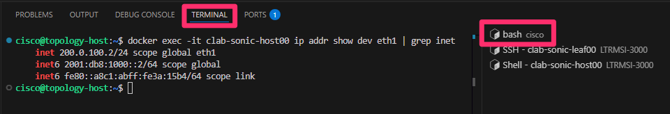
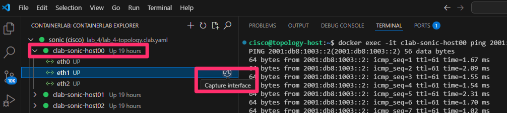
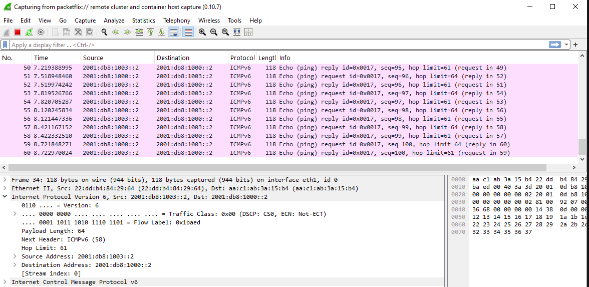

# Lab 4: SRv6 on SONiC [20 Min]

### Description
From the SONiC homepage: https://sonicfoundation.dev/

*Software for Open Networking in the Cloud (SONiC) is an open source network operating system (NOS) based on Linux that runs on switches from multiple vendors and ASICs. SONiC offers a full suite of network functionality, like BGP and RDMA, that has been production-hardened in the data centers of some of the largest cloud service providers. It offers teams the flexibility to create the network solutions they need while leveraging the collective strength of a large ecosystem and community.*
 
In lab 4 we'll work with our small SONiC CLOS topology; we'll explore the SONiC/Linux and FRR CLIs, and we'll use Ansible scripts to configure interfaces, BGP, and finally SRv6.

## Contents
- [Lab 4: SRv6 on SONiC \[20 Min\]](#lab-4-srv6-on-sonic-20-min)
    - [Description](#description)
  - [Contents](#contents)
  - [Lab Objectives](#lab-objectives)
  - [Containerlab SONiC topology](#containerlab-sonic-topology)
  - [SONiC: A Very Quick Tour](#sonic-a-very-quick-tour)
    - [SONiC Docker Containers](#sonic-docker-containers)
  - [SONiC Configuration Files](#sonic-configuration-files)
    - [config load, config reload, \& config save](#config-load-config-reload--config-save)
    - [Configure leaf00 from SONiC CLI](#configure-leaf00-from-sonic-cli)
  - [Fabric Config Automation with Ansible](#fabric-config-automation-with-ansible)
    - [Verify SONiC BGP peering](#verify-sonic-bgp-peering)
    - [SONiC SRv6 configuration](#sonic-srv6-configuration)
    - [Verify Host IPs and Routes](#verify-host-ips-and-routes)
  - [End of lab 4](#end-of-lab-4)

## Lab Objectives
We will have achieved the following objectives upon completion of Lab 4:

* Understanding of SONiC's architecture and configuration
* Understanding of SONiC FRR/BGP
* Understanding of SONiC's SRv6 configuration and capabilities


## Containerlab SONiC topology

In lab 1 our containerlab script deployed both the XRd topology and the SONiC nodes in our London data center. 

Our SONiC ML Training Fabric topology looks like this:


## SONiC: A Very Quick Tour

SONiC is Linux plus a microservices-style architecture with modules running as Docker containers. These containers comprise what can be thought of as a highly modular *router application suite*. The containers interact and communicate with each other through the Switch State Service (*`swss`*) container. The infrastructure also relies on the use of a *redis-database* engine: a key-value database to provide a language independent interface, a method for data persistence, replication and multi-process communication among all SONiC subsystems.

For a deep dive on SONiC architecture and containers please see: https://sonicfoundation.dev/deep-dive-into-sonic-architecture-design/


1. ssh to leaf00 in our topology using the visual code extension (note: password is *`admin`*)

2. List SONiC's docker containers.
    ```
    docker ps
    ```

    Expected output:
    ```
    admin@sonic:~$ docker ps
    CONTAINER ID   IMAGE                                COMMAND                  CREATED         STATUS         PORTS     NAMES
    fd325f9f71a3   docker-snmp:latest                   "/usr/bin/docker-snm…"   4 minutes ago   Up 4 minutes             snmp
    83abaaeb0eda   docker-platform-monitor:latest       "/usr/bin/docker_ini…"   4 minutes ago   Up 4 minutes             pmon
    07b16407200a   docker-sonic-mgmt-framework:latest   "/usr/local/bin/supe…"   4 minutes ago   Up 4 minutes             mgmt-framework
    e92cfef2d1a7   docker-lldp:latest                   "/usr/bin/docker-lld…"   4 minutes ago   Up 4 minutes             lldp
    e039e0c50696   docker-sonic-gnmi:latest             "/usr/local/bin/supe…"   4 minutes ago   Up 4 minutes             gnmi
    0eb9d4243f43   docker-router-advertiser:latest      "/usr/bin/docker-ini…"   6 minutes ago   Up 6 minutes             radv
    a802d70ada48   docker-fpm-frr:latest                "/usr/bin/docker_ini…"   6 minutes ago   Up 6 minutes             bgp
    c6bd49fba18d   docker-syncd-vpp:latest              "/usr/local/bin/supe…"   6 minutes ago   Up 6 minutes             syncd
    81ea6a8d2eba   docker-teamd:latest                  "/usr/local/bin/supe…"   6 minutes ago   Up 6 minutes             teamd
    98c4bb45296b   docker-orchagent:latest              "/usr/bin/docker-ini…"   6 minutes ago   Up 6 minutes             swss
    5459d7bc624a   docker-eventd:latest                 "/usr/local/bin/supe…"   6 minutes ago   Up 6 minutes             eventd
    bab374f5a2b5   docker-database:latest               "/usr/local/bin/dock…"   6 minutes ago   Up 6 minutes             database
    ```

  ### SONiC Docker Containers

| Docker Container Name| Description                                                      |
|:---------------------|:-----------------------------------------------------------------|
| BGP                  | Runs FRR [Free Range Routing](https://frrouting.org/) |
| Database             | Hosts the redis-database engine|
| LLDP                 | Hosts LLDP. Includes 3 process *llpd*, *LLDP-syncd*, *LLDPmgr* |
| MGMT-Framework       | North Bound Interfaces (NBIs) for  managing configuration and status|
| PMON                 | Runs *sensord* daemon used to log and alert sensor data |
| RADV                 | Hosts *radv* daemon and handles IPv6 router solicitations / router advertisements |
| SNMP                 | Hosts SNMP feature. *SNMPD* and *SNMP-Agent* |
| SWSS                 | Collection of tools to allow communication among all SONiC modules |
| SYNCD                | Synchronization of the switch's network state with the switch's actual hardware/ASIC |
| TeamD                | Runs open-source implementation of LAG protocol |
| GNMI                 | SONiC gnmi/telemetry service |

> [!NOTE]
> **Control Plane**: SONiC leverages the open-source [Free Range Routing](https://frrouting.org/)(FRR) routing stack for its Control Plane. Currently the only supported routing protocol is BGP, however, FRR supports ISIS and OSPF, so in the future we could see SONiC incorporating those protocols as well.
> 
> The *docker ps* output above included a container named **bgp**. In reality this is FRR running as a container.

In addition to normal Linux CLI, SONiC has its own CLI that operates from the Linux shell:

3. Try some SONiC CLI commands:
    ```
    show ?
    show interface status
    show ip interfaces
    show ipv6 interfaces
    show version
    ```
    If you would like to explore more we've included a short [SONiC CLI command reference](https://github.com/cisco-asp-web/LTRSPG-2212/blob/main/lab_4/sonic_cli_reference.md)

5. Access **leaf00's** FRR/BGP container via *vtysh*
    ```
    vtysh
    ```

    Expected output:
    ```
    admin@sonic:~$ vtysh

    Hello, this is FRRouting (version 10.0.1).
    Copyright 1996-2005 Kunihiro Ishiguro, et al.

    2025/05/04 21:01:06 [YDG3W-JND95] FD Limit set: 1048576 is stupidly large.  Is this what you intended?  Consider using --limit-fds also limiting size to 100000
    sonic# 
    ```

6. FRR looks a whole lot like classic IOS:
    ```
    show run
    show interface brief
    exit
    ```

## SONiC Configuration Files
Configuration state in SONiC is saved in two separate files. The first is the **/etc/sonic/config_db.json** file, which contains global configuration attributes such as hostname, interfaces, IP addresses, etc. The second is the FRR control plane configuration at **/etc/sonic/frr/bgpd.conf**.

### config load, config reload, & config save

**config load**

The command *config load* is used to load a configuration from an input file; the default is */etc/sonic/config_db.json*, unless specified otherwise. This command does not flush the config DB before loading the new configuration, rather it performs a *diff* on the existing and applies the new. 

- Usage:
```
config load [-y|--yes] [<filename>]
```
- Example:
```
admin@sonic::~$ sudo config load
Load config from the file /etc/sonic/config_db.json? [y/N]: y
Running command: /usr/local/bin/sonic-cfggen -j /etc/sonic/config_db.json --write-to-db
```

**config save**

*config save* is used to save the redis CONFIG_DB into the user-specified filename or into the default /*etc/sonic/config_db.json*. This is analogous to the Cisco IOS command *copy run start*. 

- Usage:
```
config save [-y|--yes] [<filename>]
```
- Example (Save configuration to /etc/sonic/config_db.json):

```
admin@sonic::~$ sudo config save -y
```

- Example (Save configuration to a specified file):
```
admin@sonic::~$ sudo config save -y /etc/sonic/config2.json
```

**Edit Configuration Through CLI**

The SONiC CLI can also be used to apply non-control plane configurations. From the Linux shell enter *config* and the command syntax needed. 
```
admin@sonic::~$ config ?
Usage: config [OPTIONS] COMMAND [ARGS]...

  SONiC command line - 'config' command
```

**Visualize The configuration Through CLI**

As network engineers, we still like to see the traditionnal "show run" on our devices. On SONiC, the *show runningconfiguration* command displays the current active configuration of various system components. You can view specific elements such as BGP, interfaces, ports, or the full configuration using subcommands like *show runningconfiguration all*. This is useful for verifying what is currently applied without needing to inspect config files directly.

```
admin@sonic:~$ show runningconfiguration all
{
    "AUTO_TECHSUPPORT": {
        "GLOBAL": {
            "available_mem_threshold": "10.0",
            "max_core_limit": "5.0",
            "max_techsupport_limit": "10.0",
            "min_available_mem": "200",
            "rate_limit_interval": "180",
            "since": "2 days ago",
            "state": "enabled"
        }
    },
    "AUTO_TECHSUPPORT_FEATURE": {
        "bgp": {
            "available_mem_threshold": "10.0",
            "rate_limit_interval": "600",
            "state": "enabled"
        },
        "database": {
            "available_mem_threshold": "10.0",
            "rate_limit_interval": "600",
            "state": "enabled"
        },
        "dhcp_relay": {
```


### Configure leaf00 from SONiC CLI

Before we proceed with applying full fabric configurations via Ansible, we wanted to demonstrate SONiC CLI by partially configuring **leaf00**


1. Using the containerlab visual code extension, ssh to *leaf00* (password is `admin`) and configure hostname and *Loopback0* IPv4 and IPv6 addresses
   ```
   sudo config hostname leaf00
   sudo config interface ip add Loopback0 10.0.0.4/32
   sudo config interface ip add Loopback0 fc00:0:1004::1/128
   ```

> [!NOTE]
> Logout and log back in to *leaf00* to see the hostname change take effect

Our SONiC fabric will use IPv6 link local addresses for the BGP underlay, so we only need to configure IPs for the host backend interface Ethernet16. The backend will be IPv6 only.

3. Configure interface Ethernet16 IPv4 and IPv6
   ```
   sudo config interface ip add Ethernet16 fcbb:0:800::1/64
   ```

4. Save configuration
   ```
   sudo config save
   ```
   
5. Exit the sonic node and ssh back in to see the hostname change in effect

6. Do a quick verification of interface IP:
   ```
   show ip interfaces 
   show ipv6 interfaces
   ```

   Example truncated output:
   ```
   admin@leaf00:~$ show ipv6 interfaces
   Interface    Master    IPv6 address/mask                        Admin/Oper    BGP Neighbor    Neighbor IP
   -----------  --------  ---------------------------------------  ------------  --------------  -------------
   Ethernet0              fe80::203d:a9ff:fe5d:83c6%Ethernet0/64   up/up         N/A             N/A
   Ethernet4              fe80::203d:a9ff:fe5d:83c6%Ethernet4/64   up/up         N/A             N/A
   Ethernet8              fe80::203d:a9ff:fe5d:83c6%Ethernet8/64   up/up         N/A             N/A
   Ethernet12             fe80::203d:a9ff:fe5d:83c6%Ethernet12/64  up/up         N/A             N/A
   Ethernet16             fcbb:0:800::1/64                         up/up         N/A             N/A
                          fe80::203d:a9ff:fe5d:83c6%Ethernet16/64                N/A             N/A
   Loopback0              fc00:0:1004::1/128                       up/up         N/A             N/A
   ```

**Manual Configuration of FRR**

Configuring SONiC's BGP container can be done from FRR's command line and is very much like IOS.

1. Invoke FRR's VTY shell
   ```
   vtysh
   ```

2. Enter configuration mode
   ```
   conf t
   ```

3. This particular SONiC image was pre-configured with a BGP instance. We'll delete that instance first, then apply the config we want:
   ```
   no router bgp 65100
   ```

4. Copy **leaf00's** FRR config [LINK](https://github.com/cisco-asp-web/LTRSPG-2212/blob/main/lab_4/sonic-config/leaf00/frr.conf) and paste it into the terminal.

5. Exit out of config mode and save the config
   ```
   write mem
   ```

6. Optional: run some *show* commands
   ```
   show run
   show bgp summary
   show interface brief
   ```   

7. Exit FRR vtysh
   ```
   exit
   ```

You may have noticed in the FRR config or show command output that SONiC supports eBGP unnumbered peering over its Ethernet interfaces. This is a huge advantage for deploying, automating, and managing hyperscale fabrics, and we wanted to highlight it here. 

Config example from leaf00:

   ```
   neighbor Ethernet0 interface remote-as 65000
   neighbor Ethernet4 interface remote-as 65001
   neighbor Ethernet8 interface remote-as 65002
   ```

## Fabric Config Automation with Ansible 

We'll use Ansible and execute the [sonic-playbook.yaml](https://github.com/cisco-asp-web/LTRSPG-2212/blob/main/lab_4/ansible/sonic-playbook.yaml) to complete the configuration of our SONiC fabric. This playbook executes a number of tasks including:

* Copy each node's *config_db.json* file to the */etc/sonic/* directory [Example spine00/config_db.json](https://github.com/cisco-asp-web/LTRSPG-2212/blob/main/lab_4/sonic-config/spine00/config_db.json)
* Load the config to activate the new settings
* Run SONiC's hostname shell script to apply the node's hostname
* Copy over and run a loopback shell script that we've created for each node [Example spine00 loopback.sh](https://github.com/cisco-asp-web/LTRSPG-2212/blob/main/lab_4/sonic-config/spine00/loopback.sh)
* Save the config
* Create and activate a loopback interface called **sr0** on each node. This loopback is needed for SONiC SRv6 functionality
* Use the Ansible built-in command plugin to enter the FRR/BGP container and delete the pre-existing default BGP config
* Copy and load FRR configs, which include BGP and SRv6 attributes, to each node; [Example spine00 frr.conf](https://github.com/cisco-asp-web/LTRSPG-2212/blob/main/lab_4/sonic-config/spine00/frr.conf)


1. Launch a terminal on the *topology host* using the visual code containerlab extension:


2. cd into the lab_4 directory and execute the *sonic-playbook.yaml*
    ```
    cd ~/LTRSPG-2212/lab_4/ansible

    ansible-playbook -i hosts sonic-playbook.yaml -e "ansible_user=admin ansible_ssh_pass=admin ansible_sudo_pass=admin" -vv
    ```

> [!CAUTION] 
> The sonic playbook produces a lot of console output. Don't worry about errors on the *vrf sysctl* task as those come from *spine* nodes where no VRFs are configured. By the time the playbook completes we expect to see something like this:

    ```
    PLAY RECAP *************************************************************************************
    leaf00   : ok=14   changed=12   unreachable=0    failed=0    skipped=0    rescued=0    ignored=0   
    leaf01   : ok=14   changed=12   unreachable=0    failed=0    skipped=0    rescued=0    ignored=0   
    leaf02   : ok=14   changed=12   unreachable=0    failed=0    skipped=0    rescued=0    ignored=0   
    leaf03   : ok=14   changed=12   unreachable=0    failed=0    skipped=0    rescued=0    ignored=0   
    spine00  : ok=14   changed=12   unreachable=0    failed=0    skipped=0    rescued=0    ignored=1   
    spine01  : ok=14   changed=12   unreachable=0    failed=0    skipped=0    rescued=0    ignored=1   
    spine02  : ok=14   changed=12   unreachable=0    failed=0    skipped=0    rescued=0    ignored=1   
    spine03  : ok=14   changed=12   unreachable=0    failed=0    skipped=0    rescued=0    ignored=1 
    ``` 

### Verify SONiC BGP peering

With BGP now configured on our DC fabric we will check to make sure that BGP peering was established. Use the below diagram as a reference to the ASN configured in the prior steps.


1. Using the visual code containerlab extension, ssh to one or more SONiC nodes and spot check BGP peering . You can SSH into any SONiC container.  (user: admin, pw: admin)

   

    ```
    vtysh
    ```
    ```
    show bgp summary
    ```
    Expected output from leaf00:
    ```
    leaf00# show bgp summary 

    IPv6 Unicast Summary:
    BGP router identifier 10.0.0.200, local AS number 65200 VRF default vrf-id 0
    BGP table version 58
    RIB entries 47, using 6016 bytes of memory
    Peers 4, using 80 KiB of memory

    Neighbor        V         AS   MsgRcvd   MsgSent   TblVer  InQ OutQ  Up/Down State/PfxRcd   PfxSnt Desc
    Ethernet0       4      65000        54        40       58    0    0 00:14:43           17       28 N/A
    Ethernet4       4      65001        99        36       58    0    0 00:14:41           17       28 N/A
    Ethernet8       4      65002        63        36       58    0    0 00:14:41           17       28 N/A
    Ethernet12      4      65003        80        36       58    0    0 00:14:41           17       28 N/A

    Total number of neighbors 4
    ```
    
### SONiC SRv6 configuration

Our SONiC topology has now been configured for SRv6 uSID forwarding with each node assigned SRv6 locators as shown in the diagram:


If your *vtysh* session is on *leaf00* keep it open. If not, ssh to *leaf00* using the visual code containerlab extension and invoke vtysh for the next few tasks:


1. Check SONiC SRv6 configuration on *leaf00*
   ```
   show run
   ```

   Example SRv6 config output:
   ```diff
   segment-routing
    srv6
      static-sids
   +   sid fc00:0:1200::/48 locator MAIN behavior uN                      <-- Locator behavior "uN"
   +   sid fc00:0:1200:fe04::/64 locator MAIN behavior uDT4 vrf default   <-- static uDT4 function for prefixes in the default ipv4 table
   +   sid fc00:0:1200:fe06::/64 locator MAIN behavior uDT6 vrf default   <-- static uDT6 function for prefixes in the default ipv6 table    
      exit
      !
    exit
    !
    srv6
      encapsulation
      source-address fc00:0:1200::1
      locators
      locator MAIN
        prefix fc00:0:1200::/48 block-len 32 node-len 16 func-bits 16
        behavior usid
      exit
      !
      exit
      !
      formats
      format usid-f3216
      exit
      !
      format uncompressed-f4024
      exit
    ```

2. Check locator/sid-manager status 
    ```
    show segment-routing srv6 locator 
    show segment-routing srv6 manager
    ```

    Expected output:
    ```
    leaf00# show segment-routing srv6 locator 
    Locator:
    Name                 ID      Prefix                   Status
    -------------------- ------- ------------------------ -------
    MAIN                       1 fc00:0:1200::/48         Up

    leaf00# show segment-routing srv6 manager 
    Parameters:
      Encapsulation:
        Source Address:
          Configured: fc00:0:1200::1
    ```

3. Compare an FRR BGP route entry and its corresponding Linux route entry:

    From the FRR vtysh session:
    ```
    show bgp ipv6 uni 2001:db8:1003::/64
    ```

    Expected output:
    ```diff
    leaf00# show bgp ipv6 uni 2001:db8:1003::/64
    BGP routing table entry for 2001:db8:1003::/64, version 27
    +Paths: (4 available, best #1, table default)
      Advertised to non peer-group peers:
      Ethernet0 Ethernet4 Ethernet8 Ethernet12
    + 65000 65203
        fe80::20a3:c7ff:fe5e:5c58 from Ethernet0 (10.0.0.0)
        (fe80::20a3:c7ff:fe5e:5c58) (prefer-global)
          Origin IGP, valid, external, multipath, best (Older Path)
          Last update: Sun Jun  1 03:17:37 2025
    + 65001 65203
        fe80::20dc:72ff:fe50:c026 from Ethernet4 (10.0.0.1)
        (fe80::20dc:72ff:fe50:c026) (prefer-global)
          Origin IGP, valid, external, multipath
          Last update: Sun Jun  1 03:17:38 2025
    + 65002 65203
        fe80::20c8:3aff:fed9:1a10 from Ethernet8 (10.0.0.2)
        (fe80::20c8:3aff:fed9:1a10) (prefer-global)
          Origin IGP, valid, external, multipath
          Last update: Sun Jun  1 03:17:38 2025
    + 65003 65203
        fe80::20f6:30ff:fe5c:9180 from Ethernet12 (10.0.0.3)
        (fe80::20f6:30ff:fe5c:9180) (prefer-global)
          Origin IGP, valid, external, multipath
          Last update: Sun Jun  1 03:17:38 2025
    ```

    FRR's BGP show command output again resembles IOS output. The prefix is known via *leaf00's* 4 BGP unnumbered neighbors.

    Exit vtysh and check the same route in the Linux table:
    ```
    exit
    ```
    ```
    ip -6 route show 2001:db8:1003::/64
    ```

    Example output:
    ```
    $ ip -6 route show 2001:db8:1003::/64
    2001:db8:1003::/64 nhid 81 proto bgp src fc00:0:1200::1 metric 20 pref medium
	  nexthop via fe80::20a3:c7ff:fe5e:5c58 dev Ethernet0 weight 1 
	  nexthop via fe80::20dc:72ff:fe50:c026 dev Ethernet4 weight 1 
	  nexthop via fe80::20c8:3aff:fed9:1a10 dev Ethernet8 weight 1 
	  nexthop via fe80::20f6:30ff:fe5c:9180 dev Ethernet12 weight 1 
    ```

    Note how the entry has the notation `*proto bgp src*` which indicates the route was learned from BGP. The route also has 4 ECMP paths via the BGP unnumbered / IPv6 link-local sessions.


### Verify Host IPs and Routes

The containerlab topology file included a number of *`exec`* commands to be run inside the *ubuntu-host* containers. These commands gave the containers their IP addresses and some basic static routes for fabric reachability.

1. Verify host IPs and routes

    From the topology host execute *docker exec* commands to display the ip addresses and routing table of ubuntu-host00:

    


    ```
    docker exec -it clab-sonic-host00 ip addr show dev eth1 | grep inet
    ```
    ```
    docker exec -it clab-sonic-host00 ip -6 route
    ```

    Expected output:
    ```
    cisco@topology-host:~$ docker exec -it clab-sonic-host00 ip addr show dev eth1 | grep inet
    inet 200.0.100.2/24 scope global eth1
    inet6 2001:db8:1000::2/64 scope global 
    inet6 fe80::a8c1:abff:fe7c:fbbd/64 scope link 

    cisco@topology-host:~$ docker exec -it clab-sonic-host00 ip -6 route
    2001:db8:1000::/64 dev eth1 proto kernel metric 256 pref medium
    2001:db8::/32 via 2001:db8:1000::1 dev eth1 metric 1024 pref medium
    fc00::/32 via 2001:db8:1000::1 dev eth1 metric 1024 pref medium
    fe80::/64 dev eth1 proto kernel metric 256 pref medium
    fe80::/64 dev eth2 proto kernel metric 256 pref medium
    ```

2. Ping test from *ubuntu-host00* to *ubuntu-host03*:

    ```
    docker exec -it clab-sonic-host00 ping 2001:db8:1003::2 -i .3 -c 100
    ```

    While the ping is running we can launch edgeshark using the visual code containerlab extension and inspect the traffic on the eth1 interface. Note the traffic is not SRv6 encapsulated at this time:

    

    Wireshark is launching and traffic is automatically intercepted.

    

    
## End of lab 4
Please proceed to [Lab 5: Host Based SRv6](https://github.com/cisco-asp-web/LTRSPG-2212/blob/main/lab_5/lab_5-guide.md)

