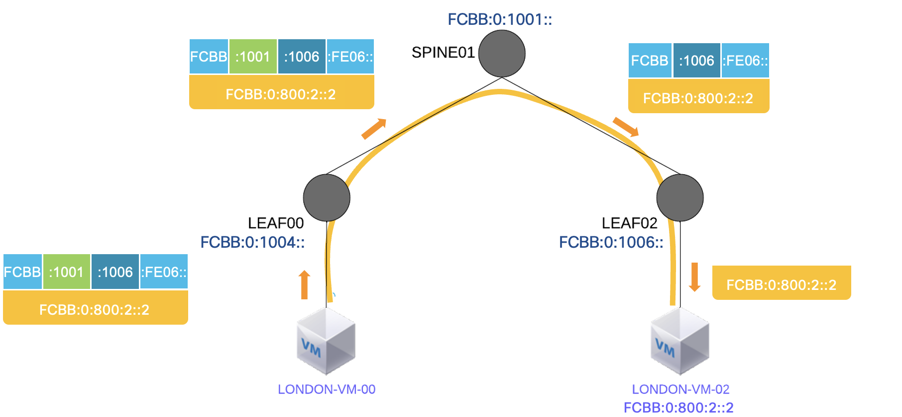
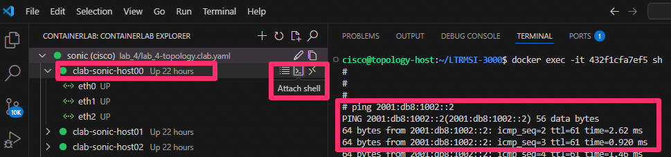
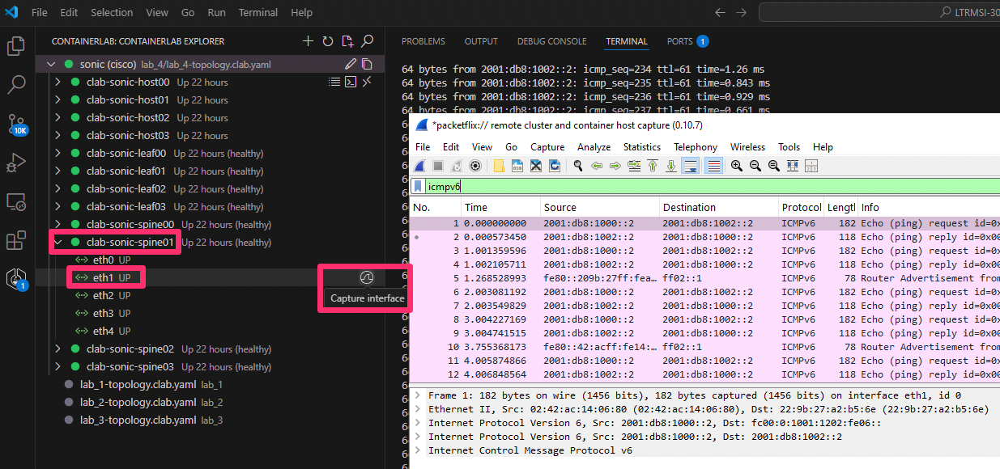
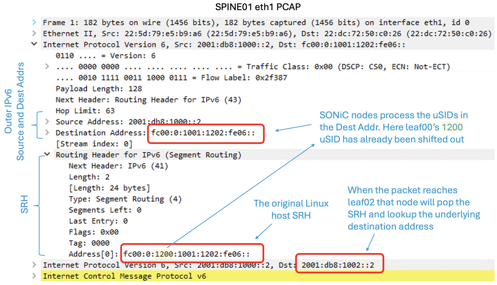
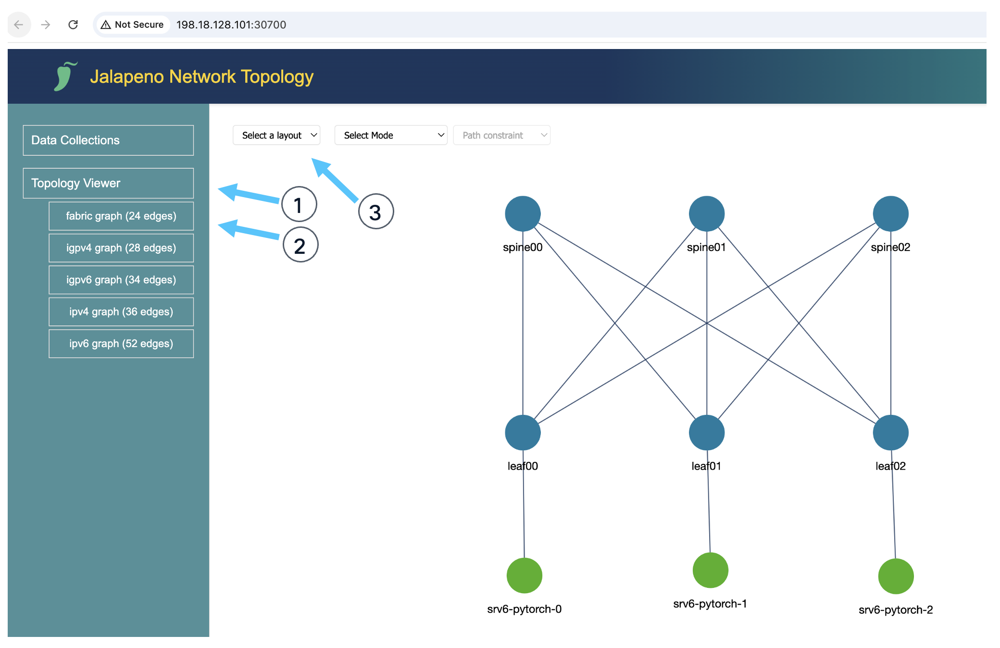
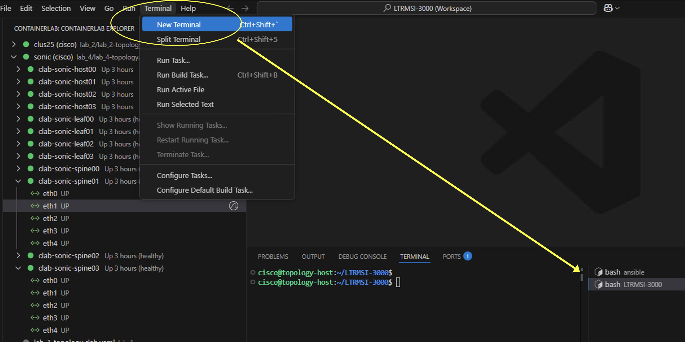
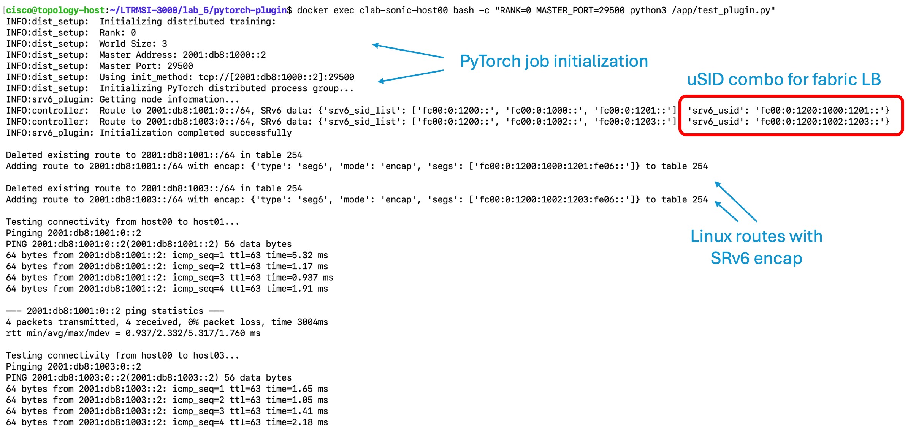

# Lab 5: SRv6 for Intelligent Load Balancing of AI Workloads [20 Min]

### Description
In recent months a few Hyperscalers have expressed interest in running SRv6 over their AI training fabrics. The idea would be to offer their customers the ability to do intelligent and deterministic load balancing of large, long-lived flows, by pinning them to specific paths thru the fabric. The goal is for SRv6 encapsulation right at the host stack or RDMA NIC: *`host-based SRv6!`*

In Lab 5 we will explore this use case with our SONiC backend fabric and the attached *london VMs* simulating an AI Training infrastructure. 


## Contents
- [Lab 5: SRv6 for Intelligent Load Balancing of AI Workloads \[20 Min\]](#lab-5-srv6-for-intelligent-load-balancing-of-ai-workloads-20-min)
    - [Description](#description)
  - [Contents](#contents)
  - [Lab Objectives](#lab-objectives)
  - [Host-Based SRv6 for Intelligent Fabric Load Balancing](#host-based-srv6-for-intelligent-fabric-load-balancing)
    - [SRv6 Linux Kernel Routes](#srv6-linux-kernel-routes)
  - [Jalapeno and Modeling Networks as Graphss](#jalapeno-and-modeling-networks-as-graphss)
  - [SRv6 PyTorch Plugin](#srv6-pytorch-plugin)
  - [End of lab 5](#end-of-lab-5)


## Lab Objectives
The student should have achieved the following objectives upon completion of Lab 5:

* Understand the SRv6 Fabric Load Balancing use case
* Familiarity with the SRv6 stack available in Linux
* Understanding of SONiC's SRv6 uSID shift-and-forward capabilities
* Familiarity with the idea of exposing SRv6 steering services to AI training frameworks and schedulers
* Bonus if time allows: familiarity with the open-source Jalapeno project, its API, and UI

## Host-Based SRv6 for Intelligent Fabric Load Balancing

At the 2025 OCP Global Summit, Changrong Wu and Abhishek Dosi from Microsoft explained how they build Source Routed AI Backend Networks with SRv6:

https://www.segment-routing.net/conferences/2025-10-16-ocp-summit25-microsoft-srv6-ai-backend/

The key problem to solve:

 - ECMP of large, long-lived flows can result in path collision or hotspots in the fabric. 
 - With AI training this can lead to delays or even job failures. 
 - Given the cost of running large GPU pools, delay or failure becomes very costly.

The solution: *coordination of all senders source routing their traffic over disjoint paths through the fabric.*

Cisco doesn't currently have a controller product for host-based SRv6 and the Hyperscalers build their own SDN control infrastructure, so to simulate this capability in the lab we've built a *`demo PyTorch SRv6 plugin`* which programs SRv6 routes in the Linux kernel, and which leverages the open-source *`project Jalapeno`* as its backend data repository.

 - SRv6 PyTorch plugin: https://github.com/segmentrouting/srv6-pytorch-plugin

 - PyTorch Homepage: https://pytorch.org/

 - SRv6 Linux Kernel Implementation: https://segment-routing.org/

 - Project Jalapeno Homepage: https://github.com/cisco-open/jalapeno


### SRv6 Linux Kernel Routes

Before we get into PyTorch and automation, let's manually add a Linux route with SRv6 encapsulation:

1. Add a Linux SRv6 route on *`host00`* to *`host02`* to take the path *`leaf00`* -> *`spine01`* -> *`leaf02`*: 


   Execute the *route add* from the *topology-host* with *docker exec*:
   **old SRH route**
   ```
   docker exec -it clab-sonic-host00 ip -6 route add 2001:db8:1002::/64 encap seg6 mode encap segs fc00:0:1200:1001:1202:fe06:: dev eth1
   ```

   **new uSID route**
   ```
   docker exec -it clab-sonic-host00 ip -6 route add 2001:db8:1002::/64 encap seg6 mode encap.red segs  fc00:0:1200:1001:1202:fe06:: dev eth1
   ```

2. Display the Linux route on *host00*:
   ```
   docker exec -it clab-sonic-host00 ip -6 route show 2001:db8:1002::/64
   ```

   Expected output:
   ```
   $ docker exec -it clab-sonic-host00 ip -6 route show 2001:db8:1002::/64
   2001:db8:1002::/64  encap seg6 mode encap.red segs 1 [ fc00:0:1200:1001:1202:fe06:: ] dev eth1 metric 1024 pref medium
   ```

   The SRv6 uSID combination in the above will route traffic to *`host02`* via *`leaf00`*, *`spine01`*, and *`leaf02`*. The uSID shift-and-forward at *leaf00* and *spine01* will result in an ipv6 destination address of **fc00:0:1202:fe06::** when the packet arrives at *leaf02*. *leaf02* recognizes itself and its local uDT6 entry *`fc06`* in the destination address and will proceed to pop the outer IPv6 header and do a lookup on the inner destination address **2001:db8:1002::/64**. *leaf02* will then forward the traffic to *`host02`*

   


3. Using the visual code containerlab extension, connect to SONiC *`leaf02`*, invoke FRR vtysh and 'show run' to see the SRv6 local SID entries:
   
   **leaf02**
   ```
   vtysh
   show run
   ```

   Partial output:
   ```
   segment-routing
   srv6
     static-sids
      sid fc00:0:1202::/48 locator MAIN behavior uN
      sid fc00:0:1202:fe04::/64 locator MAIN behavior uDT4 vrf default
      sid fc00:0:1202:fe06::/64 locator MAIN behavior uDT6 vrf default
   exit
   ```
> [!NOTE]
> To inspect specific parts of the configuration, you can also run the following command from the shell (outside of vtysh mode):
>
> sudo vtysh -c "show running-config" | grep -A 10 "segment-routing"
>
> This filters and displays the Segment Routing configuration along with the 10 lines that follow.
```
admin@leaf02:~$ sudo vtysh -c "show running-config" | grep -A 10 "segment-routing"
segment-routing
 srv6
  static-sids
   sid fc00:0:1202::/48 locator MAIN behavior uN
   sid fc00:0:1202:fe04::/64 locator MAIN behavior uDT4 vrf default
   sid fc00:0:1202:fe06::/64 locator MAIN behavior uDT6 vrf default
  exit
  !
 exit
 !
 srv6
 ```


1. Using the visual code containerlab extension, attach to **clab-sonic-host00** shell and run a ping from *host00* to *host02*

   
   
   ```
   # ping 2001:db8:1002::2
   PING 2001:db8:1002::2(2001:db8:1002::2) 56 data bytes
   64 bytes from 2001:db8:1002::2: icmp_seq=2 ttl=61 time=2.62 ms
   64 bytes from 2001:db8:1002::2: icmp_seq=3 ttl=61 time=0.920 ms
   ```

2. Optional: while the ping is running perform Edgeshark capture(s) to see the encapsulated packets and shift-and-forward in action. Recommended interfaces for Wireshark capture:
   - clab-sonic-host00 eth1
   - clab-sonic-spine01 eth1
   **Example packet capture at Spine01**

     The example packet capture below is taken from *spine01* eth1. As you can see the outer IPv6 destination address has been shifted-and-forwarded by *leaf00*. We don't need to worry about the Linux SRH because when it arrives at *leaf02* that node will see its local uDT6 entry *fc00:0:1202:fe06* and will decapsulate the entire outer header and do a lookup on the inner IPv6 destination address. *Leaf02* will then forward the inner packet to *host02*.
     <br><br>
     
     <br><br>
     

## Jalapeno and Modeling Networks as Graphss

Using the [Lab 5 scripts and data](./scripts/sonic-network/) we've created a model of our SONiC fabric topology with relevant SRv6 data in Jalapeno's Arango Graph Database. This makes the fabric topology graph available to *`PyTorch`* (or other SDN applications) via Jalapeno's API. 

Use this link to open the [Jalapeno UI](http://198.18.128.101:30700) into a new tab/window. First select "Topology Viewer", second "fabric graph", and third click the "layout" dropdown select "Clos"



After completing **Lab 5** feel free to checkout the [Lab 5 Bonus Section](./lab_5-bonus.md) that explores the Jalapeno GraphDB, API, UI, and other host-based SRv6 scenarios in more detail.

## SRv6 PyTorch Plugin

From https://pytorch.org/projects/pytorch/

*PyTorch is an open source machine learning framework that accelerates the path from research prototyping to production deployment. Built to offer maximum flexibility and speed...its Pythonic design and deep integration with native Python tools make it an accessible and powerful platform for building and training deep learning models at scale.*

**PyTorch Distributed Training:**

When you start a distributed training workload, PyTorch initializes a process group. It uses a backend like [NCCL](https://developer.nvidia.com/nccl) or [Gloo](https://github.com/pytorch/gloo) for communication between nodes. Each node gets a rank and knows about other nodes through the process group

**Pytorch-srv6-plugin's Workflow:**

Before NCCL/Gloo starts communicating, the SRv6 plugin will:

  - Get the list of nodes from the distributed workload setup
  - Query the Jalapeno API for a shortest-path (lowest *`load`* metric) for each *source/destination* pair
  - The API returns an SRv6 uSID encapsulation instruction for each *source/destination* pair that will pin traffic to a specific path in the fabric
  - The *plugin* then programs local Linux SRv6 routes, similar to the route we manually programmed earlier, on each node. 
  - The distributed workload's traffic is SRv6 encapsulated as it egresses the source *host*

The effect is the workload's traffic is intelligently load balanced across the fabric and no longer subject to the potential imbalances and congestion associated with ECMP

> [!Note]
> If we had GPUs and RDMA NICs we would work to extend the plugin to program route + SRv6 encap entries on the NIC itself


Here's a typical flow:

```
[PyTorch Training Script]
        ↓
[Initialize Distributed Training]
        ↓
[PyTorch calls NCCL or Gloo backend]
        ↓
[SRv6 Plugin intercepts, calls Jalapeno API]
        ↓
[Programs SRv6 routes]
        ↓
[NCCL/Gloo uses routes for communication]
        ↓
[Training continues normally]
```

**Pytorch-srv6-plugin demo**

The plugin includes a simple demo that uses a *`gloo`* backend because it doesn't require GPUs and still provides distributed training functionality. We'll run the demo on three of our four *host* containers:

 - host00
 - host01
 - host03

**the 'copy files' step is not needed with newly built pytorch ubuntu container image**
1. From a *topology-host* terminal session copy updated pytorch-srv6-plugin files to the Ubuntu *host* containers. 
   
   ```
   cd ~/LTRSPG-2212/lab_5/pytorch-plugin/
   ./copy-files.sh
   ```

It is most effective to run the plugin-demo from three separate terminal sessions on *topology-host*. This will show us how the plugin operates and programs SRv6 routes on each host running the distributed workload.

In the spirit of transparency, the demo initializes PyTorch and the SRv6 functionality, however, it doesn't train anything. But where the demo lacks in training functionality it makes up for in pings! 

2. Open three terminal sessions on *topology-host*

   

3. In the first terminal session initialize the test run on *host00*
   ```
   docker exec clab-sonic-host00 bash -c "RANK=0 MASTER_PORT=29500 python3 /app/test_plugin.py"
   ```

4. In the second terminal session initialize the test run on *host01*
   ```
   docker exec clab-sonic-host01 bash -c "RANK=1 MASTER_PORT=29500 python3 /app/test_plugin.py"
   ```

5. In the third terminal session initialize the test run on *host03*
   ```
   docker exec clab-sonic-host03 bash -c "RANK=2 MASTER_PORT=29500 python3 /app/test_plugin.py"
   ```

   As the PyTorch job initializes the srv6-plugin takes action. It should create SRv6 routes for each *host* to each other *host* participating in the workload.

   - *`host00`* --> *`host01`* and *`host03`*
   - *`host01`* --> *`host00`* and *`host03`*
   - *`host03`* --> *`host00`* and *`host01`*

   The "job" completes with some pings from each host to each host.

   Screenshot of output from *`host00`* with comments (each terminal should have similar output):

   

7. Optional: check the Linux ipv6 routes on *hosts*:
    ```
    docker exec -it clab-sonic-host00 ip -6 route
    ```

    *host00* output (note the route to *host02* that we manually added earlier in lab 5 is still in place):
    ```
    $ docker exec -it clab-sonic-host00 ip -6 route
    2001:db8:1000::/64 dev eth1 proto kernel metric 256 pref medium
    2001:db8:1001::/64  encap seg6 mode encap segs 1 [ fc00:0:1200:1000:1201:fe06:: ] dev eth1 proto static metric 1024 pref medium
    2001:db8:1002::/64  encap seg6 mode encap segs 1 [ fc00:0:1200:1001:1202:fe06:: ] dev eth1 metric 1024 pref medium
    2001:db8:1003::/64  encap seg6 mode encap segs 1 [ fc00:0:1200:1002:1203:fe06:: ] dev eth1 proto static metric 1024 pref medium
    2001:db8::/32 via 2001:db8:1000::1 dev eth1 metric 1024 pref medium
    fc00::/32 via 2001:db8:1000::1 dev eth1 metric 1024 pref medium
    fe80::/64 dev eth1 proto kernel metric 256 pref medium
    fe80::/64 dev eth2 proto kernel metric 256 pref medium
    ```

**Congratulations, you have reached the end of Cisco Live Lab LTRSPG-2212, hurray!!**

## End of lab 5
If you would like to explore host-based SRv6 some more feel free to try [Lab 5 Bonus Section](https://github.com/cisco-asp-web/LTRSPG-2212/blob/main/lab_5/lab_5-bonus.md)


